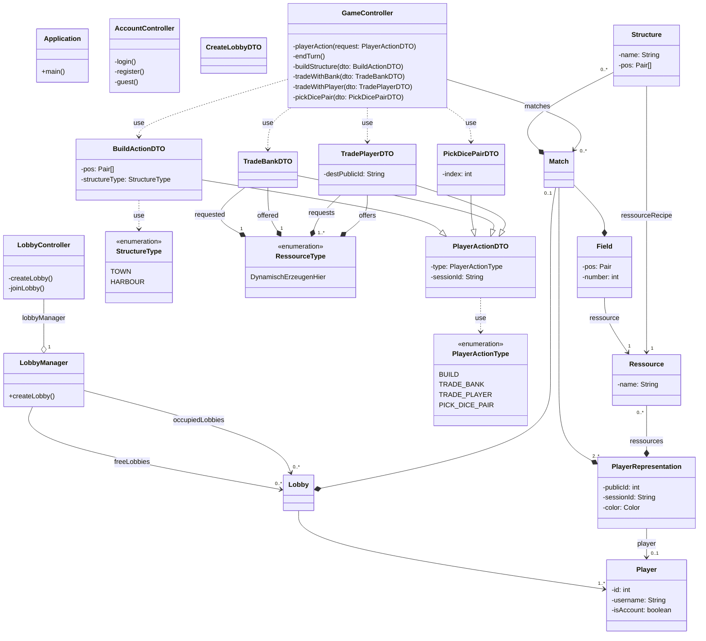

# Klassendiagramm des Backend

```mermaid
classDiagram
    class Application{
        +main()
    }

    class LobbyManager{
        +createLobby()
    }

    class Lobby{

    }
    
    class Match{
        
    }

    class AccountController{
        -login()
        -register()
        -guest()
    }

    class LobbyController{
        -createLobby()
        -joinLobby()
		
    }

	class StructureType{
	<<enumeration>>
	TOWN
	HARBOUR
	}

	class RessourceType{
	<<enumeration>>
	DynamischErzeugenHier
	}

    class PlayerActionType{
        <<enumeration>>
	BUILD
	TRADE_BANK
	TRADE_PLAYER
	PICK_DICE_PAIR
    }

    class PlayerActionDTO{
        -type: PlayerActionType
	    -sessionId: String
    }

	class CreateLobbyDTO{
    }

	%%{"type": "BUILD", "sessionId":..., "pos": [[0,0],[1,0]], "structure": "HARBOUR"}
    class BuildActionDTO{
		-pos: Pair[]
		-structureType: StructureType
	}

	class TradeBankDTO{

	}

	%%{"type":.., "sessionId":..., "destPublicId":..., "offered": [{"ressource": "STONE", "amount": 2}, {"ressource": "WOOD", "amount": 1}], "requested": [{"ressource": "GOLD", "amount": 1}]}
	class TradePlayerDTO{
		-destPublicId: String
	}

	class PickDicePairDTO{
		-index: int
    }

    class GameController{
        -playerAction(request: PlayerActionDTO)
        -endTurn()
        -buildStructure(dto: BuildActionDTO)
        -tradeWithBank(dto: TradeBankDTO)
        -tradeWithPlayer(dto: TradePlayerDTO)
        -pickDicePair(dto: PickDicePairDTO)
    }

    class Player{
		-id: int
        -username: String
        -isAccount: boolean
    }

    class Structure{
        -name: String
        -pos: Pair[]
    }

    class Ressource{
        -name: String
    }

    class Field{
		-pos: Pair
        -number: int
    }
    
    class PlayerRepresentation{
		-publicId: int
        -sessionId: String
		-color: Color
    }

    LobbyController --o "1" LobbyManager : lobbyManager
    LobbyManager --> "0..*" Lobby: freeLobbies
    LobbyManager --> "0..*" Lobby: occupiedLobbies
    Match "0..1" --* Lobby
    Lobby --> "1..*" Player
    Structure "0..*" --* Match
    Match --* Field
    Match --* "2..*" PlayerRepresentation
    PlayerRepresentation --> "0..1" Player: player
    Ressource "0..*" --* PlayerRepresentation: ressources
    Field --> "1" Ressource: ressource
    Structure --> "1" Ressource: ressourceRecipe
    GameController --> "0..*" Match: matches
    BuildActionDTO --|> PlayerActionDTO
    PickDicePairDTO --|> PlayerActionDTO
    TradeBankDTO --|> PlayerActionDTO
    TradePlayerDTO --|> PlayerActionDTO
    PlayerActionDTO ..> PlayerActionType: use
    BuildActionDTO ..> StructureType: use
    TradeBankDTO --* "1" RessourceType: requested
    TradeBankDTO --* "1" RessourceType: offered
    TradePlayerDTO --* "1..*" RessourceType: requests
    TradePlayerDTO --* "1..*" RessourceType: offers

    GameController ..> BuildActionDTO: use
    GameController ..> TradeBankDTO: use
    GameController ..> TradePlayerDTO: use
    GameController ..> PickDicePairDTO: use

```
