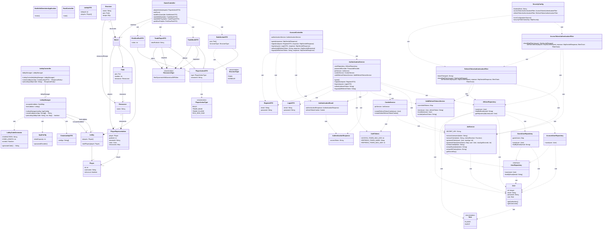

# Klassendiagramm des Backend

```mermaid
classDiagram
    class HexfieldsDominionApplication{
        +main()
    }

    class RootController{
        +root()
    }

    %% lobby
    class Lobby{
        +players: Player[]
        +addPlayer(player: Player)
    }

    class LobbyCodeGenerator{
        -CHARACTERS: String
        -CODE_LENGTH: int
        -random: Random
        +generateCode(): String
    }

    class LobbyController{
        -lobbyManager: LobbyManager
        +LobbyController(lobbyManager: LobbyManager)
        +createLobby(configs: CreateLobbyDTO): ResponseEntity<Map<String, String>>
        +joinLobby(lobbyCode: String): ResponseEntity<Map<String, Object>>
		
    }

    class LobbyManager{
        -occupiedLobbies: HashMap<String, Lobby>
        -freeLobbies: Lobby[]
        +LobbyManager(config: AppConfig)
        +createLobby(configs: String[]): String
        +joinLobby(lobbyCode: String, res: Map<String, Object>): boolean
    }

    %% lobby/dto
    class CreateLobbyDTO{
		-configs: String[]
    }

    class LobbyDTO{
		-lobbyId: int
        -players: Player[]
    }

    %% game
    class Field{
		-pos: Pair<Integer, Integer>
        -number: int
        -ressource: Ressource
    }

    class GameController{
        -playerAction(request: PlayerActionDTO)
        -endTurn()
        -buildStructure(dto: BuildActionDTO)
        -tradeWithBank(dto: TradeBankDTO)
        -tradeWithPlayer(dto: TradePlayerDTO)
        -pickDicePair(dto: PickDicePairDTO)
    }

    class Match{
        
    }

    class Ressource{
        -name: String
    }

    class Structure{
        -name: String
        -pos: Pair<Integer, Integer>[]
        -recipe: Map<RessourceType, Integer>
    }

    %% game/dto
    %% {"type": "BUILD", "sessionId":..., "pos": [[0,0],[1,0]], "structure": "HARBOUR"}
    class BuildActionDTO{
		-pos: Pair[]
		-structureType: StructureType
	}

	class PickDicePairDTO{
		-index: int
    }
    
    class PlayerActionDTO{
        -type: PlayerActionType
	    -sessionId: String
    }

	class TradeBankDTO{
        
    }

	%% {"type":.., "sessionId":..., "destPublicId":..., "offered": [{"ressource": "STONE", "amount": 2}, {"ressource": "WOOD", "amount": 1}], "requested": [{"ressource": "GOLD", "amount": 1}]}
	class TradePlayerDTO{
		-destPublicId: String
	}

    %% game/player
    class Player{
		-id: int
        -username: String
        -isAccount: boolean
    }

    class PlayerRepresentation{
		-player: Player
        -publicId: int
        -sessionId: String
		-color: Color
        -ressources: Map<Ressource, Integer>
    }

    %% game/types
    class PlayerActionType{
        <<enumeration>>
        BUILD
        TRADE_BANK
        TRADE_PLAYER
        PICK_DICE_PAIR
    }

	class RessourceType{
        <<enumeration>>
        HierDynamischMitDatenAusDBFüllen
	}

    class StructureType{
        <<enumeration>>
        TOWN
        HARBOUR
	}

    %% config
    class AppConfig{
        -initialCapacity: int
        +passwordEncoder()
    }

    class SecurityConfig{
        -frontendHost: String
        -accessTokenAuthenticationFilter: AccessTokenAuthenticationFilter
        -refreshTokenAuthenticationFilter: RefreshTokenAuthenticationFilter
        +corsConfigurationSource()
        +securityFilterChain(http: HttpSecurity)
    }

    %% config/filter
    class AccessTokenAuthenticationFilter{
        -shouldNotFilter(request: HttpServletRequest)
        -doFilterInternal(request: HttpServletRequest, reponse: HttpServletResponse, filterChain: FilterChain)
    }

    class RefreshTokenAuthenticationFilter{
        +doesFilter(path: String)
        -shouldNotFilter(request: HttpServletRequest)
        -doFilterInternal(request: HttpServletRequest, reponse: HttpServletResponse, filterChain: FilterChain)
    }

    %% account
    class AccountController{
        -authenticationService: AuthenticationService
        +guest(response: HttpServletResponse)
        +register(request: RegisterDTO, response: HttpServletResponse)
        +login(request: LoginDTO, response: HttpServletResponse)
        +refresh(oldRefreshToken: String, response: HttpServletResponse)
        +logout(oldRefreshToken: String, response: HttpServletResponse)
    }

    class AuthenticationResponse{
        -accessToken: String
    }

    class AuthenticationResult{
        -authenticationResponse: AuthenticationResponse
        -refreshTokenCookie: Cookie
    }

    class AuthenticationService{
        -userRepository: AllUserRepository
        -passwordEncoder: PasswordEncoder
        -jwtService: JwtService
        -cookieService: CookieService
        -validRefreshTokensService: ValidRefreshTokensService
        +guest()
        +register(request: RegisterDTO)
        +login(request: LoginDTO)
        +refresh(refreshToken: String)
        +logout(oldRefreshToken: String)
    }

    %% account/dto
    class LoginDTO{
        -email: String
        -password: String
    }

    class RegisterDTO{
        -email: String
        -password: String
    }

    %% account/token
    class AuthTokens{
        +ACCESS_TOKEN_MAX_AGE: int
        +REFRESH_TOKEN_NAME: String
        +REFRESH_TOKEN_MAX_AGE: int
    }

    class CookieService{
        -jwtService: JwtService
        +createRefreshTokenCookie(user: User)
        +createDeleteRefreshTokenCookie()
    }

    class JwtService{
        -SECRET_KEY: String
        +extractUsername(token: String)
        +extractClaim(token: String, claimsResolver: Function<Claims, T>)
        +generateToken(user: User, maxAge: int)
        +generateToken(extraClaims: Map<String,Object>, user: User, maxAgeSeconds: int)
        +isTokenValid(token: String)
        -extractExpiration(token: String)
        -extractAllClaims(token: String)
        -getSecretKey()
    }

    class ValidRefreshTokensService{
        -usersValidTokens: Map<String,String>
        +store(user: User, refreshToken: String)
        +invalidate(user: User)
        +isValid(refreshToken: String)
    }

    %% account/user
    class AccountUserRepository{
        +save(user: User)
    }

    class AllUserRepository{
        +save(user: User)
        +findByEmail(email: String)
        -getRepositoryByUser(user: User)
    }

    class GuestUserRepository{
        -guestUsers: Map<String,User>
        +save(user: User)
        +findByEmail(email: String)
    }

    class Role{
        <<enumeration>>
        PLAYER
        GUEST
	}

    class User{
        -id: Integer
        -email: String
        -password: String
        -role: Role
        +getAuthorities()
        +getUsername()
    }

    class UserRepository{
        <<Interface>>
        +save(user: User)
        +findByEmail(email: String)
    }

    %% RELATIONS
    LobbyController --o "1" LobbyManager : lobbyManager
    LobbyManager --> "0..*" Lobby: freeLobbies
    LobbyManager --> "0..*" Lobby: occupiedLobbies
	LobbyManager ..> CreateLobbyDTO: use
    LobbyManager ..> AppConfig: use
    LobbyManager ..> LobbyCodeGenerator: use
    Lobby --> "1..*" Player

    GameController ..> BuildActionDTO: use
    GameController ..> TradeBankDTO: use
    GameController ..> TradePlayerDTO: use
    GameController ..> PickDicePairDTO: use
    GameController --> "0..*" Match: matches
    Match "0..1" --* Lobby
    Match --* Field
    Match --* "2..*" PlayerRepresentation: players
    Structure "0..*" --* Match: structures
    Structure --> "1" Ressource: ressourceRecipe
    PlayerRepresentation --> "0..1" Player: player
    Ressource "0..*" --* PlayerRepresentation: ressources
    Field --> "1" Ressource: ressource
    BuildActionDTO --|> PlayerActionDTO
    BuildActionDTO ..> StructureType: use
    PickDicePairDTO --|> PlayerActionDTO
    TradeBankDTO --|> PlayerActionDTO
    TradePlayerDTO --|> PlayerActionDTO
    PlayerActionDTO ..> PlayerActionType: use
    TradeBankDTO --* "1" RessourceType: requested
    TradeBankDTO --* "1" RessourceType: offered
    TradePlayerDTO --* "1..*" RessourceType: requests
    TradePlayerDTO --* "1..*" RessourceType: offers

    SecurityConfig ..> AccessTokenAuthenticationFilter: use
    SecurityConfig ..> RefreshTokenAuthenticationFilter: use
    AccessTokenAuthenticationFilter ..> JwtService: use
    AccessTokenAuthenticationFilter ..> AllUserRepository: use
    AccessTokenAuthenticationFilter ..> RefreshTokenAuthenticationFilter: use
    RefreshTokenAuthenticationFilter ..> JwtService: use
    RefreshTokenAuthenticationFilter ..> ValidRefreshTokensService: use
    RefreshTokenAuthenticationFilter ..> AllUserRepository: use

    AccountController ..> AuthenticationService: use
    AccountController ..> AuthenticationResult: use
	AccountController ..> LoginDTO: use
	AccountController ..> RegisterDTO: use
    AuthenticationResult ..> AuthenticationResponse: use
    AuthenticationService ..> AllUserRepository: use
    AuthenticationService ..> JwtService: use
    AuthenticationService ..> CookieService: use
    AuthenticationService ..> ValidRefreshTokensService: use
    AuthenticationService ..> AuthenticationResult: use
    AuthenticationService ..> AuthenticationResponse: use
    AuthenticationService ..> AuthTokens: use
	AuthenticationService ..> LoginDTO: use
	AuthenticationService ..> RegisterDTO: use
    CookieService ..> JwtService: use
    CookieService ..> AuthTokens: use
    JwtService ..> User: use
    ValidRefreshTokensService ..> User: use
    AccountUserRepository ..> User: use
    AccountUserRepository ..|> UserRepository
    AllUserRepository ..> AccountUserRepository: use
    AllUserRepository ..> GuestUserRepository: use
    AllUserRepository ..> User: use
    AllUserRepository ..> Role: use
    AllUserRepository ..|> UserRepository
    GuestUserRepository ..> User: use
    GuestUserRepository ..|> UserRepository
    User ..> Role: use
    UserRepository ..> User: use
```
