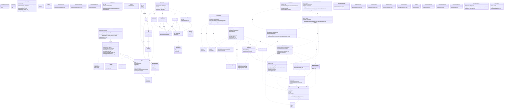

# Klassendiagramm des Backend

```mermaid
classDiagram
    class HexfieldsDominionApplication{
        +main()
    }

    class RootController{
        +root()
    }

    class SseSender~T~{
        <<abstract>>
        -groupsEmitters: Map
        -createEmitter(username: String, group: T)
        -sendEvent(emitters: Map<String, SseEmitter>, name: String, data: Object, group: T)
        -allEmitters(group: T)
        -allEmittersExcept(group: T, user: User)
        -emittersOfOnly(group: T, user: User)
        -unsubscribe(group: T, username: String)
        -onUnsubscribe(group: T, username: String)
        +[abstract] subscribe(group: T, username: String)
    }

    %% lobby
    class Lobby{
        -heartbeatHandler: HeartbeatHandler
        -players: List<Player>
        -hasAccountPlayer: boolean
        -nextPlayerId: int
        -lobbyCode: String
        -match: Match
        -owner: String
        +Lobby(config: AppConfig)
        +addPlayer(user: User, lobbyManager: LobbyManager)
        +removePlayer(username: String)
        +removePlayer(id: int)
        +isOwner(username: String)
        +onNoHeartbeat(lobby: Lobby, playerId: int)
    }

    class LobbyCodeGenerator{
        -CHARACTERS: String
        -CODE_LENGTH: int
        -random: Random
        +generateCode()
    }

    class LobbyController{
        -lobbyManager: LobbyManager
        +LobbyController(lobbyManager: LobbyManager)
        +createLobby(dto: CreateLobbyDTO)
        +joinLobby(lobbyCode: String)
        +doesLobbyWithCodeExist(lobbyCode: String, response: HttpServletResponse)
        +heartbeat(lobbyCode: String, dto: HeartbeatDTO, response: HttpServletResponse)
        +lobbyEvents(lobbyCode: String)
        +match(lobbyCode: String)
		
    }

    class LobbyManager{
        -occupiedLobbies: HashMap<String, Lobby>
        -freeLobbies: List<Lobby>
        +LobbyManager(config: AppConfig)
        +createLobby(configs: String[], owner: String)
        +joinLobby(lobbyCode: String, User user)
        +findOccupiedLobbyOrThrow(lobbyCode: String)
        -checkLobbyCleanup(lobbyCode: String, lobby: Lobby)
        -notifyLobbyUpdate(lobby: Lobby)
        +createMatchForLobby(lobby: Lobby, user: User)
        +findLobbyByMatch(matchUUID: UUID)
        -subscribe(lobbyCode: String, username: String)
        -onUnsubscribe(lobbyCode: String, username: String)
        +onNoHeartbeat(lobby: Lobby, playerId: int)
    }

    %% lobby/dto
    class CreateLobbyDTO{
		-configs: String[]
    }

    class HeartbeatDTO{
        -playerId: int
    }

    class LobbyDTO{
		-lobbyId: int
        -players: Player[]
    }

    %% lobby/error
    class InvalidRadiusException{
        +InvalidRadiusException(boardRadius: int)
    }
    
    class LobbyNotFoundException{
        +LobbyNotFoundException(lobbyCode: String)
    }

    class NotOwnerOfLobbyException{
        +NotOwnerOfLobbyException()
    }

    %% lobby/heartbeat
    class HeartbeatHandler{
        -lobby: Lobby
        -heartbeatCheckIntervalSeconds: long
        -executorService: ExecutorService
        -playerIdsExecutors: Map<Integer, HeartbeatExecutor>
        +registerNoHeartbeat(player: Player, listener: NoHeartbeatListener)
        +resetTimer(playerId: int)
    }

    class NoHeartbeatListener{
        <<Interface>>
        +onNoHeartbeat(lobby: Lobby, playerId: int)
    }

    %% game
    class Field{
		-pos: Pair<Integer, Integer>
        -number: int
        -ressource: Ressource
    }

    class GameController{
        -playerAction(request: PlayerActionDTO)
        -endTurn()
        -buildStructure(dto: BuildActionDTO)
        -tradeWithBank(dto: TradeBankDTO)
        -tradeWithPlayer(dto: TradePlayerDTO)
        -pickDicePair(dto: PickDicePairDTO)
    }

    class Match{
        
    }

    class Ressource{
        -name: String
    }

    class Structure{
        -name: String
        -pos: Pair<Integer, Integer>[]
        -recipe: Map<RessourceType, Integer>
    }

    %% game/dto
    %% {"type": "BUILD", "sessionId":..., "pos": [[0,0],[1,0]], "structure": "HARBOUR"}
    class BuildActionDTO{
		-pos: Pair[]
		-structureType: StructureType
	}

	class PickDicePairDTO{
		-index: int
    }
    
    class PlayerActionDTO{
        -type: PlayerActionType
	    -sessionId: String
    }

	class TradeBankDTO{
        
    }

	%% {"type":.., "sessionId":..., "destPublicId":..., "offered": [{"ressource": "STONE", "amount": 2}, {"ressource": "WOOD", "amount": 1}], "requested": [{"ressource": "GOLD", "amount": 1}]}
	class TradePlayerDTO{
		-destPublicId: String
	}

    %% game/player
    class Player{
		-id: int
        -username: String
        -isAccount: boolean
    }

    class PlayerRepresentation{
		-player: Player
        -publicId: int
        -sessionId: String
		-color: Color
        -ressources: Map<Ressource, Integer>
    }

    %% game/types
    class PlayerActionType{
        <<enumeration>>
        BUILD
        TRADE_BANK
        TRADE_PLAYER
        PICK_DICE_PAIR
    }

	class RessourceType{
        <<enumeration>>
        HierDynamischMitDatenAusDBFüllen
	}

    class StructureType{
        <<enumeration>>
        TOWN
        HARBOUR
	}

    %% config
    class AppConfig{
        -initialCapacity: int
        -heartbeatCheckIntervalSeconds: long
        +passwordEncoder()
    }

    class SecurityConfig{
        -frontendHost: String
        -accessTokenAuthenticationFilter: AccessTokenAuthenticationFilter
        -refreshTokenAuthenticationFilter: RefreshTokenAuthenticationFilter
        -sseTokenAuthenticationFilter: SseTokenAuthenticationFilter
        +corsConfigurationSource()
        +securityFilterChain(http: HttpSecurity)
    }

    %% config/filter
    class AccessTokenAuthenticationFilter{
        -jwtService: JwtService
        -userRepository: AllUserRepository
        -shouldNotFilter(request: HttpServletRequest)
        -doFilterInternal(request: HttpServletRequest, reponse: HttpServletResponse, filterChain: FilterChain)
    }

    class RefreshTokenAuthenticationFilter{
        -jwtService: JwtService
        -refreshTokensService: RefreshTokensService
        -userRepository: AllUserRepository
        +doesFilter(path: String)
        -shouldNotFilter(request: HttpServletRequest)
        -doFilterInternal(request: HttpServletRequest, reponse: HttpServletResponse, filterChain: FilterChain)
    }

    class SseTokenAuthenticationFilter{
        -jwtService: JwtService
        -sseTokenService: SseTokenService
        -userRepository: AllUserRepository
        +doesFilter(path: String)
        -shouldNotFilter(request: HttpServletRequest)
        -doFilterInternal(request: HttpServletRequest, reponse: HttpServletResponse, filterChain: FilterChain)
        -extractSseToken(queryString: String)
    }

    %% error
    class ControllerExceptionHandler{
        +handleNotFound(exception: Exception)
        +handleForbidden(exception: Exception)
        +handleBadRequest(exception: Exception)
        -responseOf(status: int, exception: Exception)
    }

    class BadRequestException{
        +BadRequestException(message: String)
    }

    class ForbiddenException{
        +ForbiddenException(message: String)
    }

    class InvalidDtoException{
        +InvalidDtoException(message: String)
    }

    class NotFoundException{
        +NotFoundException(message: String)
    }

    %% account
    class AccountController{
        -authenticationService: AuthenticationService
        -sseTokenService: SseTokenService
        +guest(response: HttpServletResponse)
        +register(request: RegisterDTO, response: HttpServletResponse)
        +login(request: LoginDTO, response: HttpServletResponse)
        +refresh(oldRefreshToken: String, response: HttpServletResponse)
        +logout(oldRefreshToken: String, response: HttpServletResponse)
        +sseToken()
    }

    class AuthenticationResponse{
        -accessToken: String
    }

    class AuthenticationResult{
        -authenticationResponse: AuthenticationResponse
        -refreshTokenCookie: Cookie
    }

    class AuthenticationService{
        -userRepository: AllUserRepository
        -passwordEncoder: PasswordEncoder
        -jwtService: JwtService
        -cookieService: CookieService
        -refreshTokensService: RefreshTokensService
        +guest()
        +register(request: RegisterDTO)
        +login(request: LoginDTO)
        +refresh(refreshToken: String)
        +logout(oldRefreshToken: String)
        -createNewTokensAndGetResult(user: User)
    }

    class AuthUtils{
        +getAuthenticatedUser()
    }

    %% account/dto
    class LoginDTO{
        -email: String
        -password: String
    }

    class RegisterDTO{
        -email: String
        -password: String
    }

    %% account/error
    class InvalidCharactersException{
        +InvalidCharactersException()
    }

    class InvalidCredentialsException{
        +InvalidCredentialsException()
    }

    class UserAlreadyExistsException{
        +UserAlreadyExistsException()
    }

    %% account/token
    class AuthTokens{
        +ACCESS_TOKEN_MAX_AGE: int
        +REFRESH_TOKEN_NAME: String
        +REFRESH_TOKEN_MAX_AGE: int
        +SSE_TOKEN_MAX_AGE: int
    }

    class CookieService{
        -jwtService: JwtService
        +createRefreshTokenCookie(user: User)
        +createDeleteRefreshTokenCookie()
    }

    class JwtService{
        -SECRET_KEY: String
        +extractUsername(token: String)
        +extractClaim(token: String, claimsResolver: Function<Claims, T>)
        +generateToken(user: User, maxAgeSeconds: int)
        +generateToken(extraClaims: Map<String,Object>, user: User, maxAgeSeconds: int)
        +isTokenValid(token: String)
        -extractExpiration(token: String)
        -extractAllClaims(token: String)
        -getSecretKey()
    }

    class RefreshTokensService{
        -passwordEncoder: PasswordEncoder
        +store(user: User, refreshTokenCookie: Cookie, userRepository: UserRepository)
        +invalidate(user: User, userRepository: UserRepository)
        +isValid(user: User, refreshToken: String)
    }

    class SseTokenService{
        -jwtService: JwtService
        -usernamesTokens: Map<String, String>
        +createToken(user: User)
        +getValidTokenAndInvalidate(user: User)
    }

    %% account/user
    class AccountUserRepository{
        <<Interface>>
        +save(user: User)
    }

    class AllUserRepository{
        -accountUserRepository: AccountUserRepository
        -guestUserRepository: GuestUserRepository
        +save(user: User)
        +findByUsername(username: String)
        +findByUsernameIgnoreCase(username: String)
        -getRepositoryByUser(user: User)
        +deleteAll()
    }

    class GuestUserRepository{
        -guestUsers: Map<String, User>
        +findByUsername(username: String)
        +findByUsernameIgnoreCase(username: String)
        +deleteAll()
    }

    class Role{
        <<enumeration>>
        PLAYER
        GUEST
	}

    class User{
        -id: Integer
        -username: String
        -password: String
        -email: String
        -role: Role
        -refreshToken: String
        +getAuthorities()
        +getUsername()
        +setPassword(password: String, passwordEncoder: PasswordEncoder)
        +setRefreshToken(refreshToken: String, passwordEncoder: PasswordEncoder)
    }

    class UserRepository{
        <<Interface>>
        +save(user: User)
        +findByUsername(username: String)
        +findByUsernameIgnoreCase(username: String)
        +deleteAll()
    }

    %% RELATIONS
    LobbyController --o "1" LobbyManager : lobbyManager
    LobbyManager --> "0..*" Lobby: freeLobbies
    LobbyManager --> "0..*" Lobby: occupiedLobbies
	LobbyManager ..> CreateLobbyDTO: use
    LobbyManager ..> AppConfig: use
    LobbyManager ..> LobbyCodeGenerator: use
    Lobby --> "1..*" Player

    GameController ..> BuildActionDTO: use
    GameController ..> TradeBankDTO: use
    GameController ..> TradePlayerDTO: use
    GameController ..> PickDicePairDTO: use
    GameController --> "0..*" Match: matches
    Match "0..1" --* Lobby
    Match --* Field
    Match --* "2..*" PlayerRepresentation: players
    Structure "0..*" --* Match: structures
    Structure --> "1" Ressource: ressourceRecipe
    PlayerRepresentation --> "0..1" Player: player
    Ressource "0..*" --* PlayerRepresentation: ressources
    Field --> "1" Ressource: ressource
    BuildActionDTO --|> PlayerActionDTO
    BuildActionDTO ..> StructureType: use
    PickDicePairDTO --|> PlayerActionDTO
    TradeBankDTO --|> PlayerActionDTO
    TradePlayerDTO --|> PlayerActionDTO
    PlayerActionDTO ..> PlayerActionType: use
    TradeBankDTO --* "1" RessourceType: requested
    TradeBankDTO --* "1" RessourceType: offered
    TradePlayerDTO --* "1..*" RessourceType: requests
    TradePlayerDTO --* "1..*" RessourceType: offers

    SecurityConfig ..> AccessTokenAuthenticationFilter: use
    SecurityConfig ..> RefreshTokenAuthenticationFilter: use
    AccessTokenAuthenticationFilter ..> JwtService: use
    AccessTokenAuthenticationFilter ..> AllUserRepository: use
    AccessTokenAuthenticationFilter ..> RefreshTokenAuthenticationFilter: use
    RefreshTokenAuthenticationFilter ..> JwtService: use
    RefreshTokenAuthenticationFilter ..> ValidRefreshTokensService: use
    RefreshTokenAuthenticationFilter ..> AllUserRepository: use

    AccountController ..> AuthenticationService: use
    AccountController ..> AuthenticationResult: use
	AccountController ..> LoginDTO: use
	AccountController ..> RegisterDTO: use
    AuthenticationResult ..> AuthenticationResponse: use
    AuthenticationService ..> AllUserRepository: use
    AuthenticationService ..> JwtService: use
    AuthenticationService ..> CookieService: use
    AuthenticationService ..> ValidRefreshTokensService: use
    AuthenticationService ..> AuthenticationResult: use
    AuthenticationService ..> AuthenticationResponse: use
    AuthenticationService ..> AuthTokens: use
	AuthenticationService ..> LoginDTO: use
	AuthenticationService ..> RegisterDTO: use
    CookieService ..> JwtService: use
    CookieService ..> AuthTokens: use
    JwtService ..> User: use
    ValidRefreshTokensService ..> User: use
    AccountUserRepository ..> User: use
    AccountUserRepository ..|> UserRepository
    AllUserRepository ..> AccountUserRepository: use
    AllUserRepository ..> GuestUserRepository: use
    AllUserRepository ..> User: use
    AllUserRepository ..> Role: use
    AllUserRepository ..|> UserRepository
    GuestUserRepository ..> User: use
    GuestUserRepository ..|> UserRepository
    User ..> Role: use
    UserRepository ..> User: use
```
