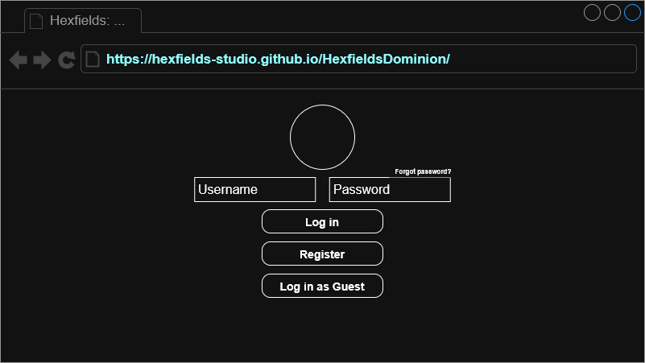
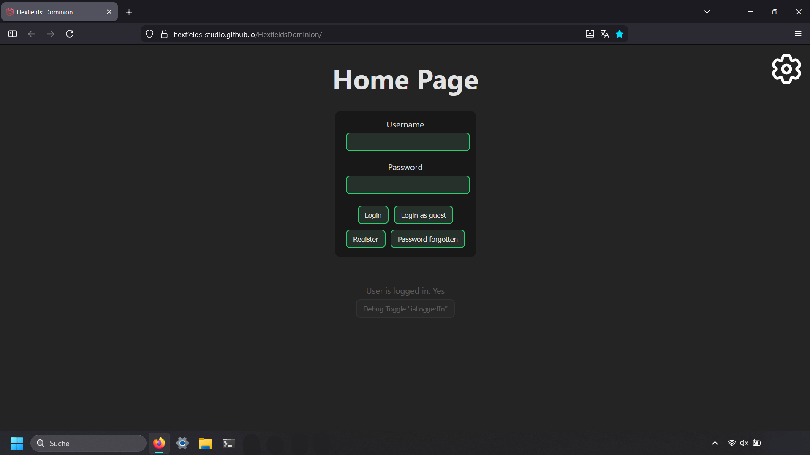

# Use-Case Spezifikation: Home Page

## 1. Home Page

### 1.1 Beschreibung

Dieses Use-Case ermöglicht es einem User, auf die Webseite zu gelangen.

### 1.2 Mockup

### 1.3 Screenshot

## 2. Ablauf von Ereignissen

### 2.1. Grundlegender Ablauf

Dieser Ablauf beschreibt den Prozess, der von einem Spieler ausgeführt wird, um auf die Webseite zu gelangen:

1. Der Spieler gibt die URL des Spiels ein: [https://hexfields-studio.github.io/HexfieldsDominion/](https://hexfields-studio.github.io/HexfieldsDominion/)
2. Die Home Page wird angezeigt.

### 2.2. Alternative Abläufe

- **Server nicht erreichbar**: Die Internetseite wird nicht geladen.
- **Anmeldung**: *[siehe Use-Case Login](../../account_management/login/login.md)*
- **Gast-Anmeldung**: *[siehe Use-Case Gast-Login](../../account_management/gast_login/gast_login.md)*
- **Registrierung**: *[siehe Use-Case Registrierung](../../account_management/registration/registration.md)*
- **Passwort Zurücksetzen**: *[siehe Use-Case Password Reset](../../account_management/password_reset/password_reset.md)*

## 3. Besondere Anforderungen

n/a

## 4. Vorbedingungen

- Der User ist nicht mit einem Account angemeldet.
- Der User ist nicht als Gast anmeldet.

## 5. Nachbedingungen

- Der Spieler kann sich im nächsten Schritt registrieren/anmelden/als Gast anmelden/das Passwort zurücksetzen lassen.

## 6. Story Points

n/a
