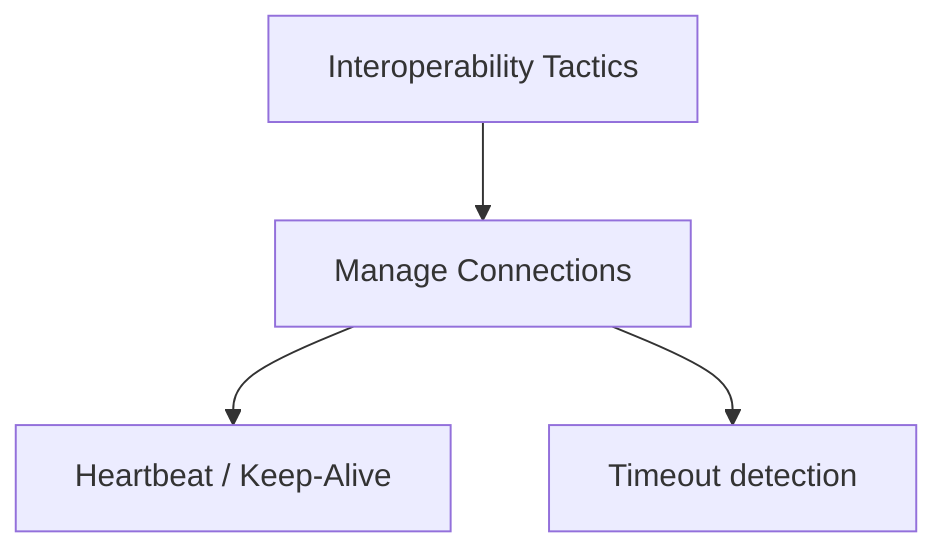
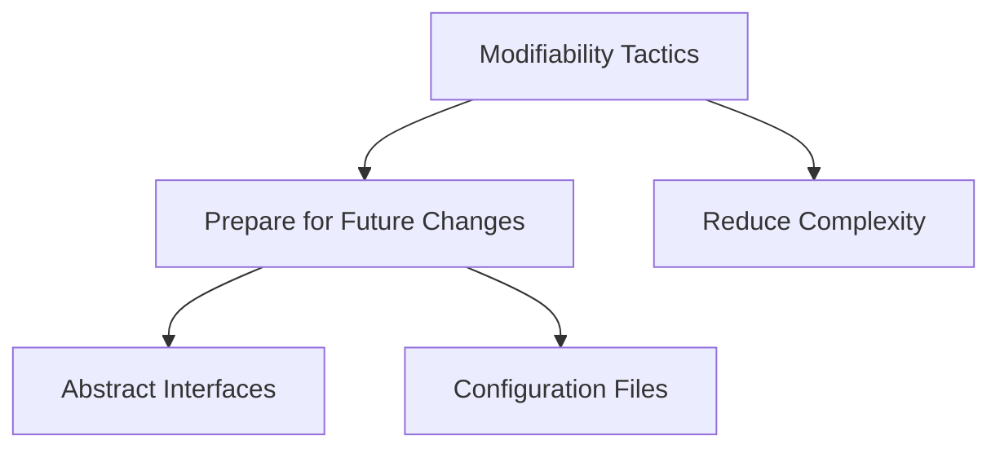
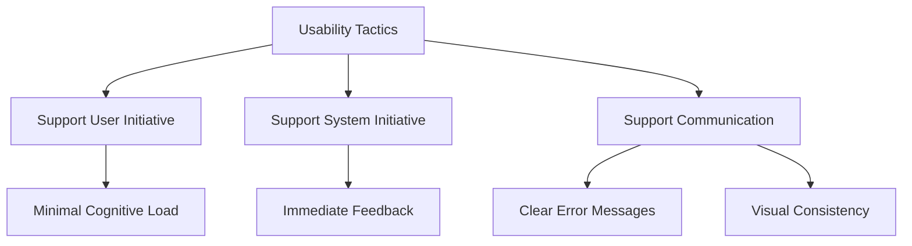
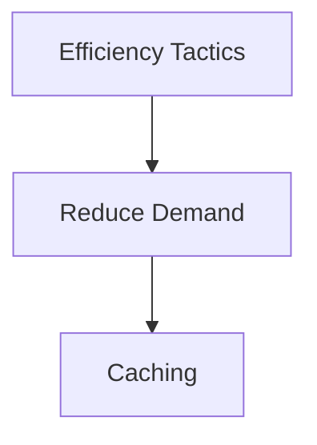
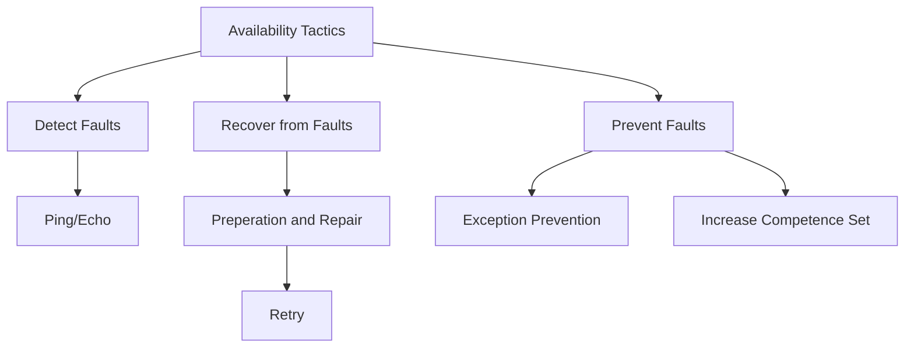
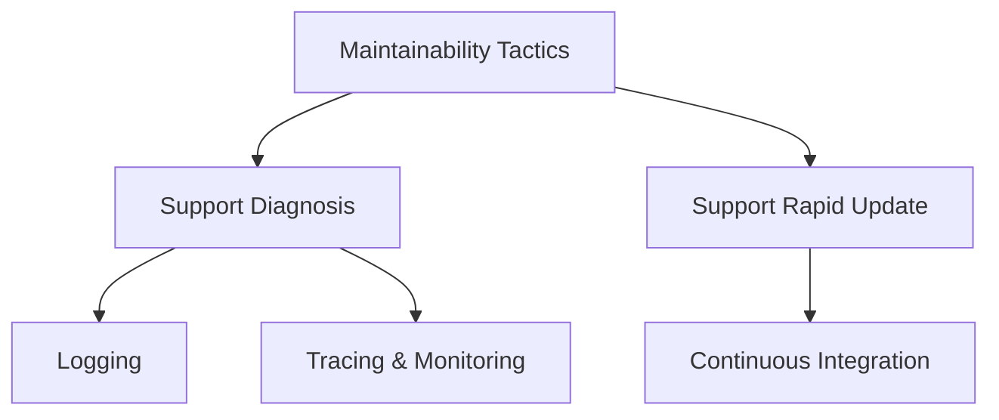

# Architecture Significant Requirements (ASR) - Hexfields: Dominion - Version 1.1

## Revision History

| Date | Version | Description | Author |
|------|---------|-------------|--------|
| 24/Nov/2025 | 1.0 | Dokument erstellt | Alex, Jona, Marcel |
| 25/Nov/2025 | 1.1 | Kleine Verbesserungen | Marcel |

## Inhaltsverzeichnis

- [Architecture Significant Requirements (ASR) - Hexfields: Dominion - Version 1.1](#architecture-significant-requirements-asr---hexfields-dominion---version-11)
  - [Revision History](#revision-history)
  - [Inhaltsverzeichnis](#inhaltsverzeichnis)
  - [1. Einleitung](#1-einleitung)
    - [1.1 Zweck](#11-zweck)
    - [1.2 Definitionen, Akronyme und Abkürzungen](#12-definitionen-akronyme-und-abkürzungen)
    - [1.3 Referenzen](#13-referenzen)
    - [1.4 Übersicht](#14-übersicht)
  - [2. Architekturdokumentation](#2-architekturdokumentation)
    - [2.1 Six Part Tabelle](#21-six-part-tabelle)
    - [2.2 Utility Tree Tabelle](#22-utility-tree-tabelle)
    - [2.3. Tactic Trees (Mermaid)](#23-tactic-trees-mermaid)
      - [2.3.1 Interoperabilität: Timeout bei Verbindungsabbruch](#231-interoperabilität-timeout-bei-verbindungsabbruch)
      - [2.3.2 Modifizierbarkeit: Modding des Spiels](#232-modifizierbarkeit-modding-des-spiels)
      - [2.3.3 Nutzbarkeit: Intuitive Steuerung, Fehlerfeedback](#233-nutzbarkeit-intuitive-steuerung-fehlerfeedback)
      - [2.3.4 Effizienz: Cache anfertigen](#234-effizienz-cache-anfertigen)
      - [2.3.5 Erreichbarkeit: Wiederholter Verbindungsaufbau](#235-erreichbarkeit-wiederholter-verbindungsaufbau)
      - [2.3.6 Maintainability: Fehleraufnahme und Aktualisierungen](#236-maintainability-fehleraufnahme-und-aktualisierungen)
    - [2.4 Architekturbeschreibungen](#24-architekturbeschreibungen)
      - [2.4.1 Lobby-Code in der URL](#241-lobby-code-in-der-url)
      - [2.4.2 Match-UUID in der URL](#242-match-uuid-in-der-url)
      - [2.4.3 Speichern von Ressourcen und Baurezepten](#243-speichern-von-ressourcen-und-baurezepten)
      - [2.4.4 Heatbeat](#244-heatbeat)
      - [2.4.5 DOS-Verteidigung](#245-dos-verteidigung)
      - [2.4.6 Arbeitsspeicher-Management von Matches](#246-arbeitsspeicher-management-von-matches)
      - [2.4.7 Spielzug TRADE\_PLAYER](#247-spielzug-trade_player)
  - [3. Unterstützende Informationen](#3-unterstützende-informationen)

## 1. Einleitung

### 1.1 Zweck

Diese Architekturspezifikation dient zur Erklärung der Architekturentscheidungen für das Videospiel "Hexfields: Dominion". Architekturentscheidungen sind bewusste, begründete Wahlhandlungen, die festlegen, wie ein System konstruiert wird, um ein Qualitätsziel zu erreichen.

### 1.2 Definitionen, Akronyme und Abkürzungen

| Bezeichnung | Definition |
| :---- | :---- |
| Ressource | Ein Material, das für den Bau von verschiedenen Gebäuden zwischen den Feldern benötigt wird. |
| Gebäude | Verschiedene Gebäude können zwischen den Feldern gebaut werden. Sie ermöglichen es, Ressourcen zu erhalten. |
| Bank | Die Bank ist eine Funktion des Spiels, über die ein Spieler Ressourcen tauschen kann. Spieler können immer mit der Bank handeln, allerdings mit relativ hohen Kosten. Durch das Bauen von mindestens einem Hafen können diese gesenkt werden. |
| Feld | Eine Hexagon-förmige Fläche, die visuell eine Ressource darstellt und diese auch an einen Spieler abgeben kann. Jedes individuelle Feld besitzt von Spielbeginn an eine Zahl. |
| Spielfeld | Das Spielfeld besteht aus mehreren Feldern, die direkt aneinander zusammengefügt sind. |
| Siegespunkt | Ein Spieler sammelt Siegpunkte durch das Erreichen von Zielen. Erreicht ein Spieler eine festgelegte Anzahl von Siegespunkten, gewinnt dieser das Spiel. |
| Ziel | Jedes Ziel besteht aus einer festgelegten Bedingung. Solange ein Spieler diese Bedingung erfüllt, erhält er für das Erreichen des Ziels Siegpunkte. |
| Entwicklung | Eine Karte, die besondere Fähigkeiten oder Vorteile für den Spieler bietet. |
| Modus | Ein Satz von Spielregeln, es wird beim Starten des Spiels ausgewählt. |
| Würfeln | Jeder Spieler würfelt automatisch am Anfang seines Zuges zwei Würfel. |
| Spielzugphase | Einteilung der aufeinander folgenden Aktionen, wenn ein neuer Spieler am Zug ist. Es gibt die Ertrags-, Handels- und Bauphase. |
| UUID | Universally Unique Identifier - eine eindeutige Identifikationsnummer für Matches. |

### 1.3 Referenzen

| Titel | Änderungsdatum | Organisation |
| :---- | :---- | :---- |
| [GitHub Organisation & Blog](https://github.com/Hexfields-Studio) | Nov/2025 | Hexfields Studio |
| [GitHub Repository: Frontend](https://github.com/Hexfields-Studio/HexfieldsDominion) | Nov/2025 | Hexfields Studio |
| [GitHub Repository: Backend](https://github.com/Hexfields-Studio/HexfieldsDominion-Backend) | Nov/2025 | Hexfields Studio |
| [GitHub Repository: Artefakte](https://github.com/Hexfields-Studio/HexfieldsDominion-Artefacts) | Nov/2025 | Hexfields Studio |
| [GitHub Pages: Webseite](https://hexfields-studio.github.io/HexfieldsDominion/) | Nov/2025 | Hexfields Studio |

### 1.4 Übersicht

Kapitel 2 bietet alle Komponenten unserer Architekturanalyse, sowie begründete Entscheidungen bei deren Implementation.

## 2. Architekturdokumentation

### 2.1 Six Part Tabelle

| Q - Attribut | Stimulus Quelle | Stimulus | Artefakt | Umgebung | Reaktion | Messung |
| :---- | :---- | :---- | :---- | :---- | :---- | :---- |
| Modifiability | Entwickler | Implementierung neuer Features. | Code | Development | Feature wurde implementiert | Ist die Implementation neuer Features einfach? |
| Interoperability | System | Über die bestehende Verbindung des Spielers informiert bleiben. | System | Development | Das Backend erkennt Clients, die die Kommunikation unterbrechen. | Clients, die nicht mehr mit dem Backend kommunizieren, können erkannt werden. |
| Usability | Spieler | Spielen des Spiels. | System | Production | Der Spieler versteht die Steuerung. | Kann der Spieler die Steuerung intuitiv kennenlernen? |
| Usability | Spieler | Es treten Fehler auf/falsche Eingaben/…. | System | Production | Der Spieler wird informiert, was passiert ist/falsch gemacht wurde. | Ist dem Spieler immer klar, warum etwas für ihn Unerwartetes (aufgrund von Fehlern) passiert? |
| Efficiency | Spieler | Anfrage von Ressourcen | System | Production | Das Backend beantwortet eine Anfrage. | Requests werden innerhalb von 3 Sekunden vom Backend beantwortet. |
| Availability | System | Einen DOS-Angriff verhindern in Bezug auf die Verfügbarkeit von Lobbies. | System | Development | Das Backend erkennt unzulässige Lobby-Anfragen. | Backend bietet nach einem Angriff immer noch freie Lobbys an. |

### 2.2 Utility Tree Tabelle

| Q - Attribut | Refinement | Q - Attribut Szenario | Business Value | Technical Risk |
| :---- | :---- | :---- | :---- | :---- |
| Modifiability | Neue Features | Ein Entwickler möchte mit Mods Teile des Spiels verändern. Das soll möglichst einfach machbar sein. | M | L |
| Interoperability | Zurkenntnisnahme über Verbindungsabbruch | Ein Client (Spieler) kommuniziert einen Verbindungsabbruch mit dem Backend. Das Backend empfängt diese Mitteilung. | H | H |
|  | Erkennung eines Verbindungsabbruch | Ein Client (Spieler) beendet die Kommunikation, ohne sie anzukündigen (z. B. durch Strom/Internetausfall). Das Backend erkennt diesen Verbindungsabbruch. | H | H |
| Usability | Intuitive Steuerung | Ein neuer Spieler befindet sich in einem Match und lernt die Steuerung intuitiv kennen, ohne dass sie erklärt werden muss. | H | L |
|  | Feedback bei Fehlern | Ein Spieler möchte einer Lobby per Code beitreten. Da der Code ungültig ist, wird eine Fehlermeldung angezeigt. | H | L |
| Efficiency | Effizienter Umgang mit Systemressourcen im Backend | Weil das Backend automatisch die Spiele-Server und -Lobbies skaliert, verbraucht das System in Zeiten von niedriger Belastung weniger Ressourcen und ist damit günstiger im Unterhalt. | H | M |
|  | Geplante Bereinigungen der Datenbank | Die Datenbank löscht regelmäßig ungenutzte Accounts und Spiel-Lobbies, was Speicherplatz in der Cloud freigibt. | H | M |
| Maintainability | Regelmäßige Updates | Ein Entwickler stößt auf Mängel bei HTTP-Anfragen, behebt Fehler und verteilt die Korrektur innerhalb von maximal 10 Arbeitsstunden. | M | H |

### 2.3. Tactic Trees (Mermaid)

#### 2.3.1 Interoperabilität: Timeout bei Verbindungsabbruch

Client erkennt Verbindungsabbruch und informiert Backend, Backend erkennt plötzlichen Abbruch selbst.



#### 2.3.2 Modifizierbarkeit: Modding des Spiels

Ein Entwickler möchte Mods Teile des Spiels verändern. Das soll möglichst einfach machbar sein.



#### 2.3.3 Nutzbarkeit: Intuitive Steuerung, Fehlerfeedback

Neue Spieler lernen Steuerung intuitiv und es gibt Fehlerfeedback bei misslungener Code-Eingabe



#### 2.3.4 Effizienz: Cache anfertigen

Durch das Caching von häufig genutzten Inhalten wird die Zugriffszeit verringert.



#### 2.3.5 Erreichbarkeit: Wiederholter Verbindungsaufbau

Das Backend erkennt (Un-)Erreichbarkeit durch den Heartbeat des Frontends und weicht auf erneuten Verbindungsaufbau und wiederholten Versuchen aus. Fehler sollten im Voraus vermieden oder elegant an den User weitergegeben werden.



#### 2.3.6 Maintainability: Fehleraufnahme und Aktualisierungen

Durch das Festhalten von Fehlern innerhalb der Konsole und Logs werden auftretende Fehler festgehalten und können zu einem späteren Zeitpunkt abgerufen werden. Durch kontinuierliche Integration auf GitHub Pages wird das Frontend immer aktuell gehalten, das Backend startet täglich neu und lädt immer die aktuellste Version des Containers herunter.



### 2.4 Architekturbeschreibungen

#### 2.4.1 Lobby-Code in der URL

Eine URL, die zu einer Spiel-Lobby führt, hat den Aufbau [https://hexfields-studio.github.io/HexfieldsDominion/lobby/[Lobbycode]](https://hexfields-studio.github.io/HexfieldsDominion/lobby/ABE431E). So ist ein einfacher Beitritt zur Lobby möglich, da lediglich der Lobbycode benötigt wird. Die Daten sind außerdem konsistent, sodass sowohl beim Beitritt per Lobbycode im Startmenü als auch durch Klicken auf einen geteilten Link zu einer Lobby mit denselben Werten gearbeitet wird. Damit wird möglicher Verwirrung von Spielern vorgebeugt, die beispielsweise den Code aus der Url kopieren, der dann aber gar kein gültiger Lobbycode wäre. Da die Lobbies bereits fest bestehen und bei der Erstellung nur neu vergeben werden, haben sie eine feste ID. Das macht es notwendig, den Code als zusätzliche Spalte in die Datenbank und als zusätzliche Attribute zu Lobbyobjekten im Backend hinzuzufügen. Das ist auch ein Grund dafür, dass in der URL die Lobby anders als mit deren ID identifiziert werden muss. Andernfalls könnten kurze IDs wie “1” unästhetisch wirken.  

#### 2.4.2 Match-UUID in der URL

Eine Match URL hat den Aufbau [https://hexfields-studio.github.io/HexfieldsDominion/match/[uuid]](https://hexfields-studio.github.io/HexfieldsDominion/match/asdf-asdf-asdf-asdf). Mithilfe der UUID kann ein Match eindeutig identifiziert werden. Da die Ids für Matches komplett unabhängig gewählt werden können, war die Idee, die URL mit einer längeren ID, hier einer UUID, ästhetischer und professioneller wirken zu lassen. Da die Spieler über die Lobby beitreten können und höchstens die gesamte Match URL zum Teilen kopieren, ist es hierbei auch nicht notwendig, dass die ID besonders einfach abzutippen o.ä. ist.  

#### 2.4.3 Speichern von Ressourcen und Baurezepten

Ressourcen und Baurezepte von Gebäuden werden in einer Datenbank gespeichert. Da diese, z.B. zum Balancing, hin und wieder angepasst werden müssen, sollten sie aus dem Code ausgelagert werden. Außerdem können auf diese Weise auch Ressourcen ohne Programmierkenntnisse hinzugefügt und in Baurezepten genutzt werden. Dabei muss beachtet werden, dass diese Daten aus der Datenbank mit dem Backend gleichwertig gehalten werden müssen. Möglicherweise ist hierzu ein Neustart des Backends oder ein Neuladen der Datenbank durch das Backend erforderlich.

#### 2.4.4 Heatbeat

Clients sollen alle 5 Sekunden einen Heartbeat, der ihr Anmeldetoken beinhaltet, an das Backend senden, sodass das Backend erkennen kann, ob ein Client noch aktiv am Spiel beteiligt ist. Diese Information ist für das Schonen von Ressourcen relevant, weil dadurch z. B. Lobbies freigelegt oder Matches gelöscht werden können, in denen sowieso kein Client aktiv ist. Auf der Seite des Backends sollen also Account-Objekte, die für eine Zeit von 10 Sekunden keinen Heartbeat erhalten haben, gelöscht werden.  

#### 2.4.5 Caching von Anmeldetoken

Zusätzlich verwaltet das Backend eine Hashmap, in der die öffentliche IP-Adresse eines Clients mit dem zuletzt über ein Heartbeat gesendeten Anmeldetoken verbunden wird. Wenn ein Client erneut einen Heartbeat sendet, kann mithilfe der Hashmap schnell sichergestellt werden, dass ein Client nur Heartbeats für einen Account sendet. Somit wird ein potenzieller Angriffsvektor vermieden, in dem sich ein Client z. B. mehrere Gastzugänge erstellen lassen und dann mit diesen mehreren Gastzugängen Lobbys erstellen, um unnötige Ressourcen zu verbrauchen. Den Angreifer würden wir hierbei jedoch erwischen, da wir einfach den zuletzt gesendeten Anmeldetoken aus der Hashmap erhalten und auf eine Differenz vergleichen können. Unterscheiden sich beide Tokens, schließt das Backend sofortig die Verbindung mit dem Client, um eine Überladung des Backends zu vermeiden.

#### 2.4.6 Arbeitsspeicher-Management von Matches

Wenn ein Match mit mindestens einem registrierten Spieler gestartet wird, dann wird der Spielstand sowohl im Arbeitsspeicher als auch in der Datenbank festgehalten. Wenn ein Match gestartet wird, wobei kein Spieler ein registriertes Konto hat bzw. alle Spieler beim Start des Matches einen Gast-Login benutzt haben, so wird das Spiel ausschließlich im Arbeitsspeicher des Backends festgehalten. Mithilfe eines Accounts können wiederkehrende Spieler eindeutig zugeordnet werden. Wenn also kein Spieler der Lobby einen Account beim Start des Spieles aufweisen konnte, kann keinem Spieler das Match und dessen Position darin zugeordnet werden. Damit ist auch das Verhalten der Lobby beim Verbindungsabbruch aller Spieler festgelegt:

- a. Wenn es ein Spiel ohne registrierte Spieler ist, wird es nach dem Verbindungsabbruch und einem Countdown das Match beendet und die Lobby freigegeben.
- b. Bei einem Spiel mit registrierten Spielern dagegen wird bei Verbindungsabbruch das Match abgespeichert und erst dann die Lobby freigegeben. Sofern dann der registrierte Spieler das Spiel wieder aufnimmt (durch Eingabe der UUID), werden die Daten des Matches aus der Datenbank auf der Server geladen und das Spiel kann weitergehen, wo es aufgehört hat. Die restlichen Spieler werden automatisch zugeordnet, sofern möglich. Sonst müssen die Spieler ihre Positionen selbst finden und einnehmen.

#### 2.4.7 Tauschgeschäft-Spielzug

Wenn als Spielzug ein Tausch von Ressourcen zwischen Spielern gewählt wird, so wird diese Handelsanfrage folgendermaßen festgehalten:

```json
{  
    "type":...,
    "sessionId":...,
    "destPublicId":...,
    "offered": [{"resource": "...", "amount": 2}, {"resource": "...", "amount": 1}],
    "requested": [{"resource": "...", "amount": 1}]
}
```

Diese JSON-Struktur ermöglicht eindeutige Zuordnung und Bestimmung von den beteiligten Spielern und Materialien im Tausch. Im Frontend gibt es dann ein Fenster, bei welchem die beteiligten Spieler abwechselnd das Tauschangebot annehmen, bearbeiten oder ablehnen können. Wenn beide Spieler annehmen, wird der Tausch abgeschlossen. Wenn ein Spieler ablehnt, dann wird das Tauschangebot gelöscht. Die Spieler können abwechselnd den Tausch bearbeiten, um sich auf ein korrektes Geschäft zu einigen. Wenn eine Variation des Tauschangebots mehrmals vorgeschlagen wird, so kann das Tauschgeschäft automatisch auslaufen.

## 3. Unterstützende Informationen

Für weitere Informationen kontaktieren Sie das Hexfields Studio Team oder besuchen Sie unsere [GitHub Organisation](https://github.com/Hexfields-Studio).
