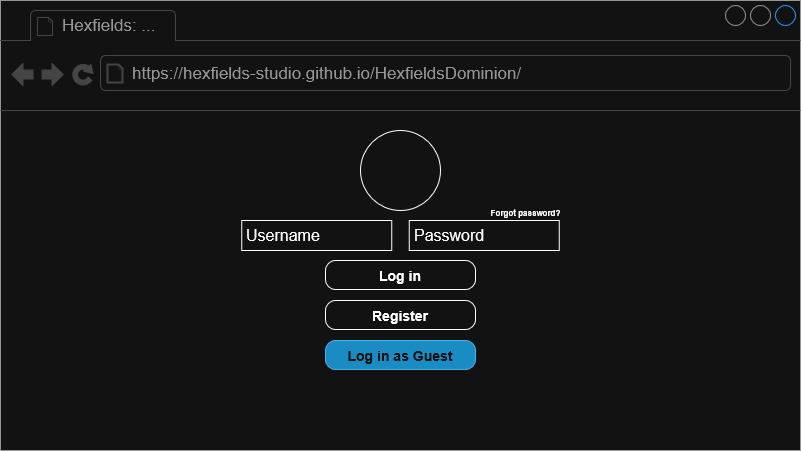
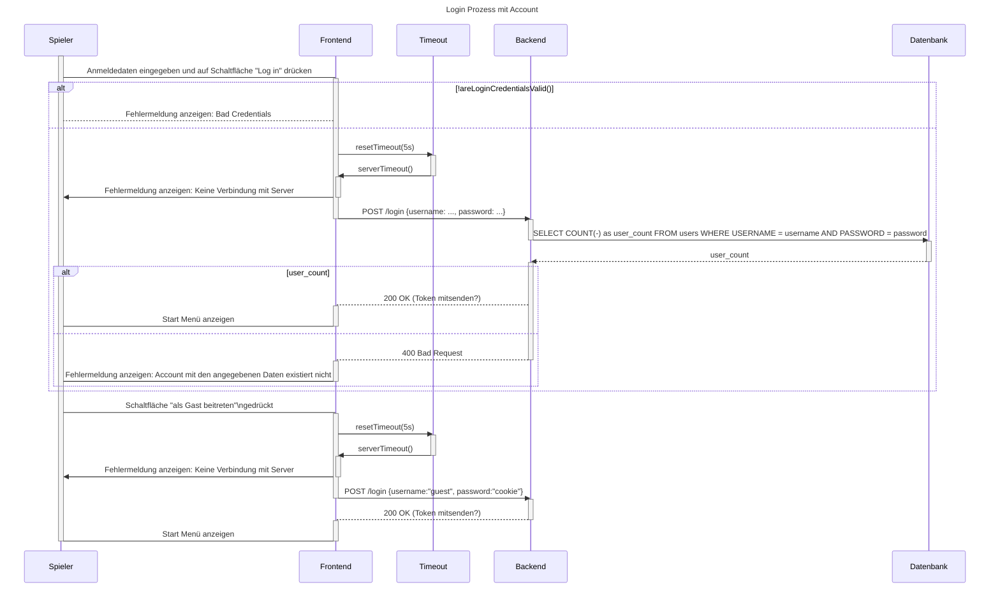

# Use-Case Spezifikation: Guest Login

## 1. Gast Login

### 1.1 Beschreibung

Dieses Use-Case ermöglicht es einem User, sich auf der Startseite ohne Konto mit einen anonymen Gast-Konto anzumelden.

### 1.2 Mockup

### 1.3 Screenshot

n/a

## 2. Ablauf von Ereignissen

### 2.1 Grundlegender Ablauf

Dieser Ablauf beschreibt den Prozess, der von einem Spieler für den Log In als Gast ausgeführt wird. Der Prozess besteht aus diesen Schritten in dieser Reihenfolge:

1. Der Spieler drückt auf die "Als Gast beitreten" Schaltfläche  
2. Der Client macht eine Anfrage für einen Gast Log In auf Server und startet ein Timeout  
3. Der Server übermittelt einen Anmeldetoken für den Gastzugang an den Client  
4. Der Client stoppt das Timeout, speichert den Anmeldetoken lokal und öffnet das „Start Menü“

Sollte in beiden Abläufen das Timeout getriggert werden, soll der Client eine Fehlermeldung anzeigen, dass der Server momentan nicht verfügbar ist.  

#### Sequenzdiagramm (Mermaid)

*Kopie aus [login.md: Sequenzdiagramm (Mermaid)](../login/login.md#sequenzdiagramm-mermaid)*

### 2.2 Alternative Abläufe

- **Server nicht erreichbar**: Fehlermeldung wird angezeigt und die Anmeldung schlägt fehl.
- **Bereits als Gast angemeldet**: Bestehende Gast-Session wird beibehalten.

## 3. Besondere Anforderungen

n/a

## 4. Vorbedingungen

- Die Startseite ist geöffnet.
- Der User ist mit keinem Konto angemeldet.

## 5. Nachbedingungen

- Der User ist als Gast angemeldet.
- Die Seite kehrt zur Startseite zurück.

## 6. Story Points

n/a
