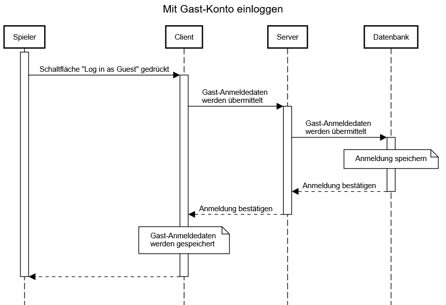

# Use-Case Spezifikation: Guest Login

## 1. Gast Login

### 1.1 Beschreibung

Dieses Use-Case ermöglicht es einem User, sich auf der Startseite ohne Konto mit einen anonymen Gast-Konto anzumelden.

### 1.2 Mockup

### 1.3 Screenshot

n/a

## 2. Ablauf von Ereignissen

### 2.1 Grundlegender Ablauf

- Der User ist nicht angemeldet und befindet sich auf der Startseite.
- Der User klickt auf den Knopf „Log in as guest“.
- Die Anmeldedaten des User werden aus dem lokalen Speicher entfernt.
- Die App kehrt zum Anmeldebildschirm zurück.

#### Sequenz Diagram

### 2.2 Alternative Abläufe

- **Server nicht erreichbar**: Fehlermeldung wird angezeigt und die Anmeldung schlägt fehl.
- **Bereits als Gast angemeldet**: Bestehende Gast-Session wird beibehalten.

## 3. Besondere Anforderungen

n/a

## 4. Vorbedingungen

- Die Startseite ist geöffnet.
- Der User ist mit keinem Konto angemeldet.

## 5. Nachbedingungen

- Der User ist als Gast angemeldet.
- Die Seite kehrt zur Startseite zurück.

## 6. Story Points

n/a
