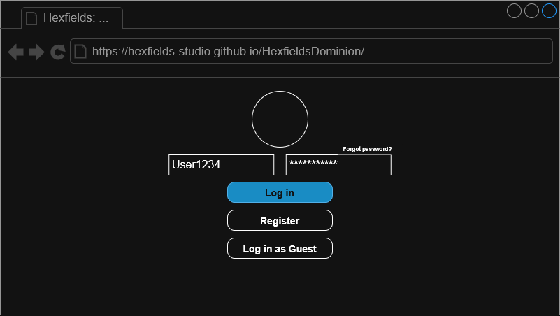
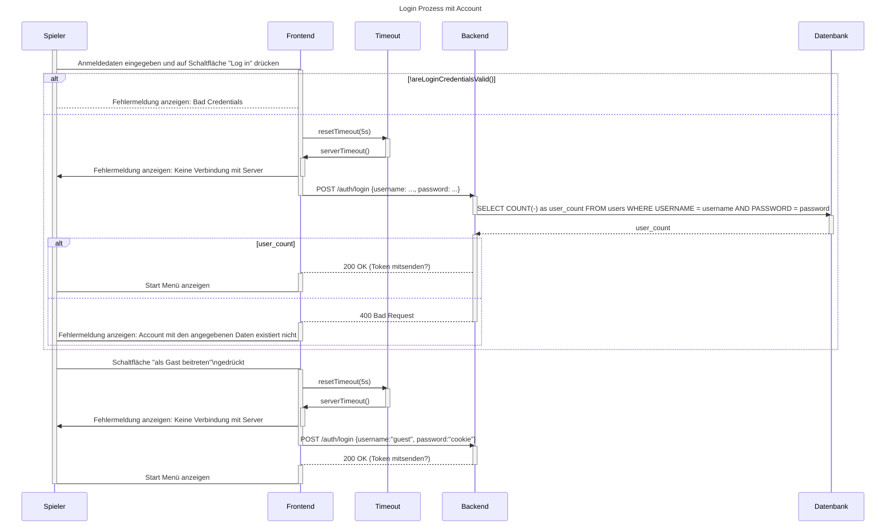

# Use-Case Spezifikation: Login

## 1. Login

### 1.1 Beschreibung

Dieses Use-Case ermöglicht es einem User, sich mit seinem Konto anzumelden.

### 1.2 Mockup

### 1.3 Screenshot

n/a

## 2. Ablauf von Ereignissen

### 2.2. Grundlegender Ablauf

Dieser Ablauf beschreibt den Prozess, der von einem Spieler für den Log In mit einem Account ausgeführt wird. Der Prozess besteht aus diesen Schritten in dieser Reihenfolge:

1. Der Spieler gibt seine Anmeldedaten im Client ein und betätigt die "Log in" Schaltfläche
2. Der Client leitet die Anmeldedaten an den Server weiter und startet ein Timeout
3. Der Server übermittelt die Anmeldedaten zur Überprüfung an die Datenbank
4. Die Datenbank sucht nach einem User mit den angegebenen Anmeldedaten und bestätigt somit die Existenz
5. Der Server benachrichtigt die erfolgreiche Anmeldung an den Client
6. Der Client stoppt das Timeout, speichert den Anmeldetoken lokal und öffnet das "Start Menü"

Sollte der Timeout ablaufen, soll der Client eine Fehlermeldung anzeigen, dass der Server momentan nicht verfügbar ist.

#### Sequenzdiagramm (Mermaid)

#### Aktivitätsdiagramm (Mermaid)

### 2.2 Alternative Abläufe

- **Server nicht erreichbar**: Fehlermeldung wird angezeigt und die Anmeldung schlägt fehl.
- **Falsche Anmeldedaten**: Fehlermeldung wird angezeigt, User kann Daten erneut eingeben
- **Gast-Anmeldung**: *[siehe Use-Case Gast-Login](../gast_login/gast_login.md)*

## 3. Besondere Anforderungen

- Der User hat bereits ein Konto eingerichtet

## 4. Vorbedingungen

- Die Home Page ist geöffnet.
- Der User ist abgemeldet.

## 5. Nachbedingungen

- Der User ist angemeldet.
- Die Seite führt zum Start Menü.

## 6. Story Points

n/a
