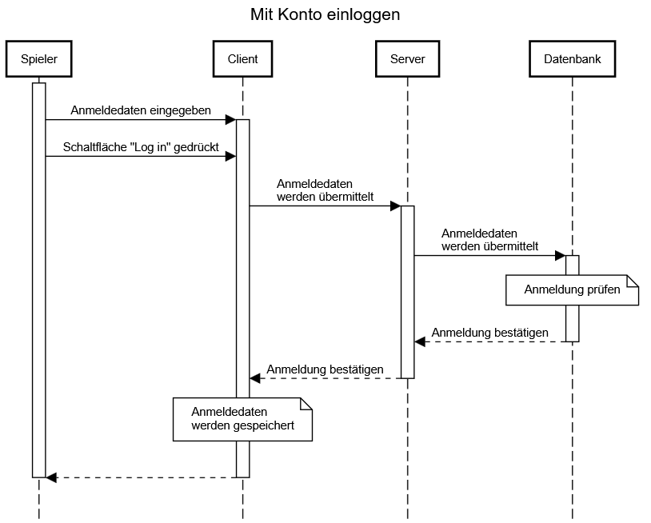
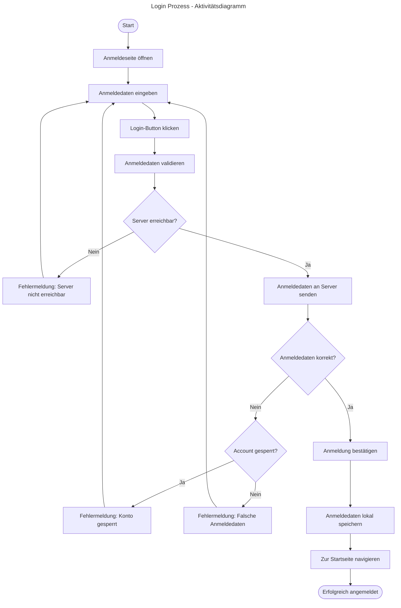

# Use-Case Spezifikation: Login

## 1. Login

### 1.1 Beschreibung

Dieses Use-Case ermöglicht es einem User, sich mit seinem Konto anzumelden.

### 1.2 Mockup

### 1.3 Screenshot

n/a

## 2. Ablauf von Ereignissen

### 2.1 Grundlegender Ablauf

- Der User ist abgemeldet und befindet sich auf der Anmeldeseite.
- Der User gibt in den Feldern seine Anmeldedaten ein und klickt auf „Log in“.
- Die Anmeldedaten des User werden geprüft.
- Die Anmeldedaten werden gespeichert
- Die App kehrt zur Startseite zurück.

#### Sequenz-Diagramm

#### Aktivitäts-Diagramm (Mermaid)

### 2.2 Alternative Abläufe

- **Server nicht erreichbar**: Fehlermeldung wird angezeigt und die Anmeldung schlägt fehl.
- **Falsche Anmeldedaten**: Fehlermeldung wird angezeigt, User kann Daten erneut eingeben

## 3. Besondere Anforderungen

- Der User hat bereits ein Konto eingerichtet

## 4. Vorbedingungen

- Die Anmeldeseite ist geöffnet.
- Der User ist abgemeldet.

## 5. Nachbedingungen

- Der User ist angemeldet.
- Die Seite kehrt zur Startseite zurück.

## 6. Story Points

n/a
