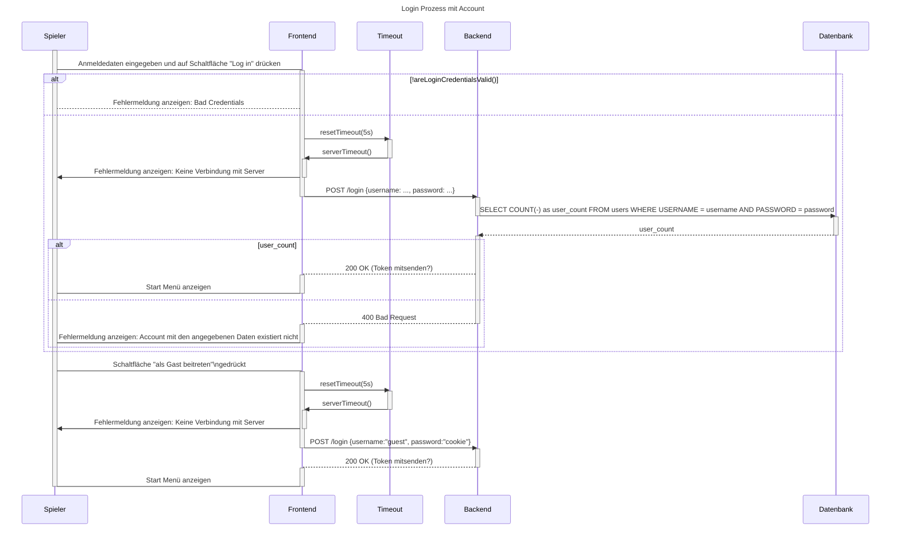

# Use Case Realization Specification: Login - Version 1.0

## Revision History

| Date | Version | Description | Author |
| ----- | ----- | ----- | ----- |
| 22/10/2025 | 0.9 | Initial Document | Marcel |
| 24/10/2025 | 1.0 | Added content and diagram pictures | Alex, Jona, Marcel |
|  |  |  |  |
|  |  |  |  |
|  |  |  |  |

## Table of Contents

- [Use Case Realization Specification: Login - Version 1.0](#use-case-realization-specification-login---version-10)
  - [Revision History](#revision-history)
  - [Table of Contents](#table-of-contents)
  - [1. Introduction](#1-introduction)
    - [1.1. Purpose](#11-purpose)
    - [1.2. Scope](#12-scope)
    - [1.3. Definitions, Acronyms, and Abbreviations](#13-definitions-acronyms-and-abbreviations)
    - [1.4. References](#14-references)
    - [1.5. Overview](#15-overview)
  - [2. Flow of Events - Design](#2-flow-of-events---design)
    - [Sequenzdiagramm (Mermaid)](#sequenzdiagramm-mermaid)
  - [2.2. Grundlegender Ablauf: Login](#22-grundlegender-ablauf-login)
  - [2.3. Alternativer Ablauf: Als Gast anmelden](#23-alternativer-ablauf-als-gast-anmelden)
  - [3. Derived Requirements](#3-derived-requirements)
    - [Implementation Requirements](#implementation-requirements)

## 1. Introduction

### 1.1. Purpose

Dieses Dokument beschreibt die Realisierung des "Login" Use-Cases für -das Spiel Hexfields: Dominion-.

### 1.2. Scope

Dieses UCRS deckt den Login-Prozess ab und ist Teil der Überkategorie "Account Management". Verwandte Use-Cases umfassen "Login as Guest", "Logout", "Password-Reset" und "Registration".

### 1.3. Definitions, Acronyms, and Abbreviations

| Begriff | Erklärung |
| :---- | :---- |
| User/Spieler | Der Benutzer des Systems |
| Client | Die clientseitige Anwendung (Web-Browser) |
| Server | Der Anwendungsserver |
| Datenbank | Die persistente Datenspeicherung auf externer Datenbank |

### 1.4. References

- Use-Case Spezifikation des Login: [login.md](./login.md)
- Use-Case Spezifikation des Gast-Login: [login_guest.md](../gast_login/gast_login.md)
- Sequenzdiagramm: [login.md: Sequenzdiagramm (Mermaid)](./login.md#sequenzdiagramm-mermaid)

### 1.5. Overview

Dieses Dokument beschreibt im Abschnitt 2 den Entwurfsablauf des Login-Prozesses anhand von Sequenz- und Aktivitätsdiagrammen. Abschnitt 3 listet abgeleitete Anforderungen auf. In Abschnitt 4 befinden sich Kopien der referenzierten Diagramme.

## 2. Flow of Events - Design

Der Login-Use-Case wird durch die Zusammenarbeit mehrerer Komponenten realisiert: Spieler (Benutzer), Client, Server und Datenbank.

### Sequenzdiagramm (Mermaid)

*Kopie aus [login.md: Sequenzdiagramm (Mermaid)](./login.md#sequenzdiagramm-mermaid)*

## 2.2. Grundlegender Ablauf: Login

Dieser Ablauf beschreibt den Prozess, der von einem Spieler für den Log In mit einem Account ausgeführt wird. Der Prozess besteht aus diesen Schritten in dieser Reihenfolge:

1. Der Spieler gibt seine Anmeldedaten im Client ein und betätigt die "Log in" Schaltfläche
2. Der Client leitet die Anmeldedaten an den Server weiter und startet ein Timeout
3. Der Server übermittelt die Anmeldedaten zur Überprüfung an die Datenbank
4. Die Datenbank sucht nach einem User mit den angegebenen Anmeldedaten und bestätigt somit die Existenz
5. Der Server benachrichtigt die erfolgreiche Anmeldung an den Client
6. Der Client stoppt das Timeout, speichert den Anmeldetoken lokal und öffnet das "Start Menü"

Sollte der Timeout ablaufen, soll der Client eine Fehlermeldung anzeigen, dass der Server momentan nicht verfügbar ist.

## 2.3. Alternativer Ablauf: Als Gast anmelden

Dieser Ablauf beschreibt den Prozess, der von einem Spieler für den Log In als Gast ausgeführt wird. Der Prozess besteht aus diesen Schritten in dieser Reihenfolge:

1. Der Spieler drückt auf die "Als Gast beitreten" Schaltfläche  
2. Der Client macht eine Anfrage für einen Gast Log In auf Server und startet ein Timeout  
3. Der Server übermittelt einen Anmeldetoken für den Gastzugang an den Client  
4. Der Client stoppt das Timeout, speichert den Anmeldetoken lokal und öffnet das „Start Menü“

Sollte in beiden Abläufen das Timeout getriggert werden, soll der Client eine Fehlermeldung anzeigen, dass der Server momentan nicht verfügbar ist.  
Das folgende Sequenzdiagramm stellt beide Abläufe dar.

## 3. Derived Requirements

### Implementation Requirements

- Sicherheit: Anmeldedaten dürfen nicht unverschlüsselt übertragen werden  
- Performance: Die Authentifizierung soll innerhalb von 5 Sekunden abgeschlossen sein.
- Benutzerfreundlichkeit: Fehlermeldungen müssen klar und hilfreich formuliert sein
- Validierung: Serverseitige Validierung der Eingabedaten (zur Vermeidung von SQL-Injektion o.Ä.)  
- Sichere Datenspeicherung: Anmeldedaten müssen sicher lokal gespeichert werden  
- Kompatibilität: Unterstützung verschiedener Browser und Endgeräte  
- Einfache Bedienung: Passwort-Manager sollten mit den Eingabefeldern kompatibel sein  
- DDOS Schutz: Ein Rate-Limit auf der Seite des Servers soll hier DDOS-Angriffe vermeiden.
