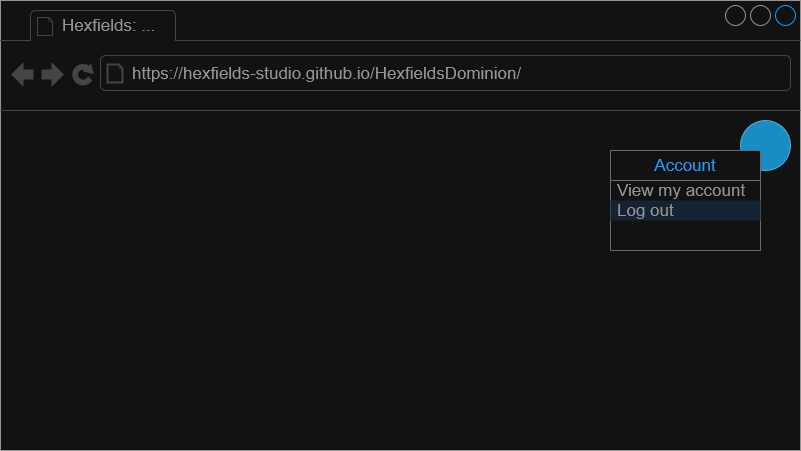
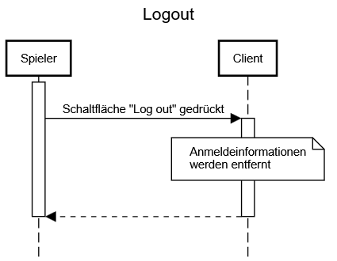

# Use-Case Spezifikation: Logout

## 1. Logout

### 1.1 Beschreibung

Dieses Use-Case ermöglicht es einem angemeldeten User, sich auf der Startseite von seinem Konto abzumelden.

### 1.2 Mockup

### 1.3 Screenshot

n/a

## 2. Ablauf von Ereignissen

### 2.1 Grundlegender Ablauf

- Der User ist angemeldet.
- Der User klickt auf das Kontosymbol und anschließend auf „Log out“.
- Die Anmeldedaten des User werden aus dem lokalen Speicher entfernt.
- Die App kehrt zur Startseite zurück.

#### Activity Diagram

### 2.2 Alternative Abläufe

- **Automatischer Logout bei Inaktivität**: Session wird nach Timeout automatisch beendet
- **Browser schließen ohne Logout**: Session bleibt aktiv für spätere Wiederaufnahme

## 3. Besondere Anforderungen

- Der User hat bereits ein Konto eingerichtet

## 4. Vorbedingungen

- Die Startseite ist geöffnet.
- Der User ist in seinem Konto angemeldet.

## 5. Nachbedingungen

- Die Sitzungsdaten werden entfernt.
- Die Seite kehrt zur Startseite zurück.

## 6. Story Points

n/a
