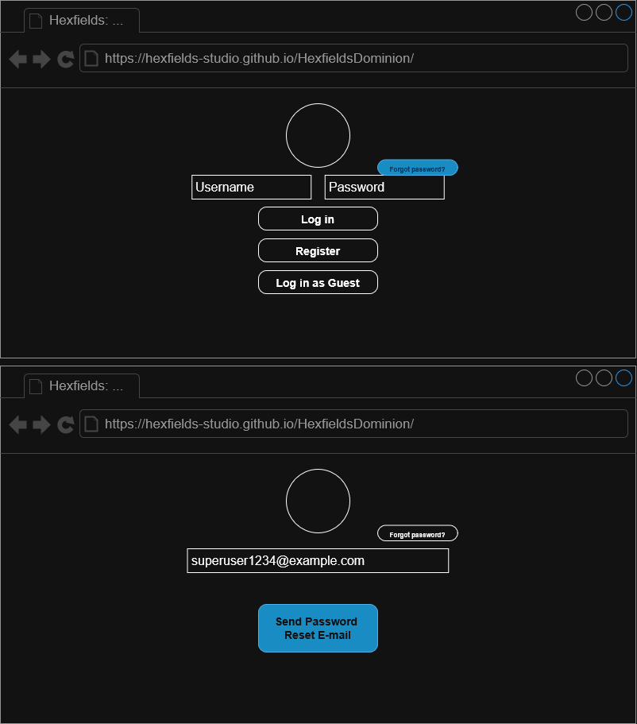
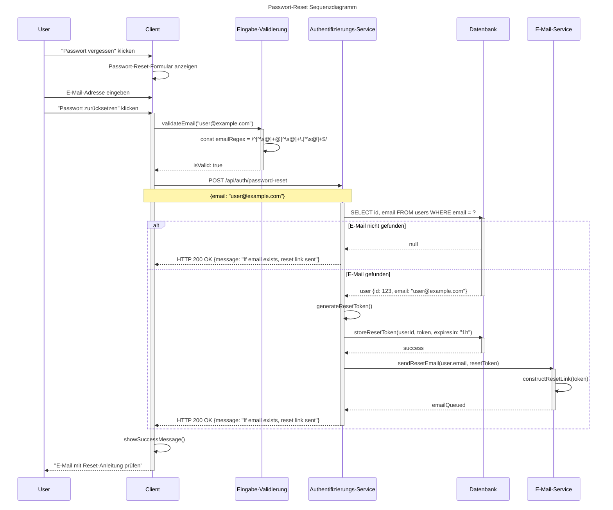

# Use-Case Spezifikation: Passwort Reset

## 1. Passwort Reset

### 1.1 Beschreibung

Dieses Use-Case ermöglicht es einem User, sein Passwort zurückzusetzen, falls er es vergessen hat.

### 1.2 Mockup

### 1.3 Screenshot

n/a

## 2. Ablauf von Ereignissen

### 2.1 Grundlegender Ablauf

- Der User ist abgemeldet und befindet sich auf der Anmeldeseite.
- Der User klickt auf "Passwort vergessen".
- Der User gibt seine E-Mail-Adresse ein.
- Der User klickt auf "Passwort zurücksetzen".
- Eine E-Mail wird an die angegebene Adresse geschickt, mit einem zufällig generiertem Passwort.
- Der User wird zur Anmeldeseite weitergeleitet.

#### Sequenzdiagramm (Mermaid)

### 2.2 Alternative Abläufe

- **Ungültiges Passwort**: Fehlermeldung wird angezeigt mit Anforderungen an das Passwort.

## 3. Besondere Anforderungen

- Der User muss Zugriff auf die registrierte E-Mail-Adresse haben.
- Der Reset-Link hat eine begrenzte Gültigkeitsdauer.

## 4. Vorbedingungen

- Die Passwort-zurücksetzen-Seite ist geöffnet.
- Der User ist abgemeldet.

## 5. Nachbedingungen

- Das Passwort wurde geändert.
- Der User wird zur Anmeldeseite weitergeleitet.

## 6. Story Points

n/a
