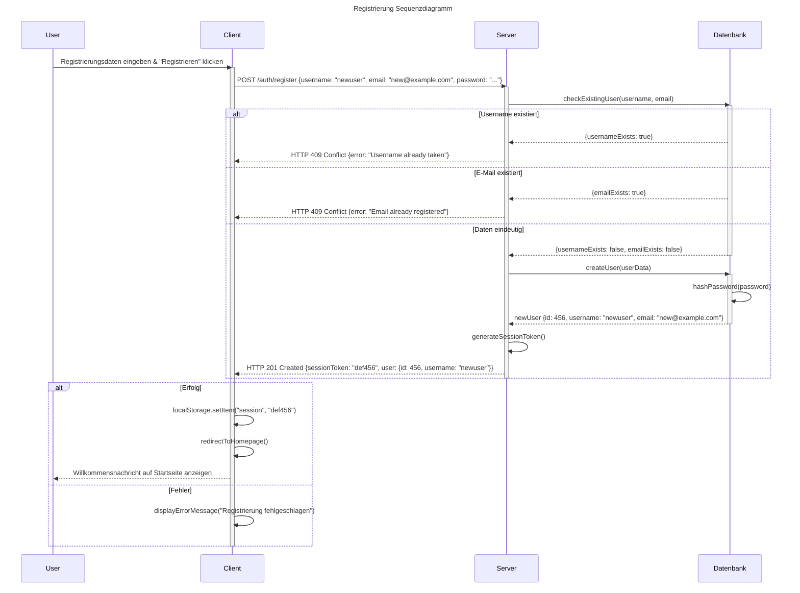

# Use-Case Spezifikation: Registration

## 1. Registration

### 1.1 Beschreibung

Dieses Use-Case ermöglicht es einem neuen User, sich ein Konto zu erstellen.

### 1.2 Mockup

### 1.3 Screenshot

n/a

## 2. Ablauf von Ereignissen

### 2.1 Grundlegender Ablauf

- Der User ist abgemeldet und befindet sich auf der Anmeldeseite.
- Der User klickt auf "Sign up" oder "Registrieren".
- Der User gibt in den Feldern seine Daten ein (Username, E-Mail, Passwort, Passwort bestätigen).
- Der User klickt auf "Register".
- Die Daten des User werden geprüft (Eindeutigkeit, Passwortstärke, etc.).
- Ein neues Konto wird erstellt.
- Die Anmeldedaten werden gespeichert.
- Die App kehrt zur Startseite zurück.

#### Sequenz Diagramm

### 2.2 Alternative Abläufe

- **Username bereits vergeben**: Fehlermeldung wird angezeigt, User wird aufgefordert einen anderen Usernamen zu wählen.
- **E-Mail bereits registriert**: Fehlermeldung wird angezeigt, User wird informiert dass die E-Mail bereits existiert.
- **Passwort zu schwach**: Fehlermeldung wird angezeigt mit Anforderungen an das Passwort.

## 3. Besondere Anforderungen

- Der User hat noch kein Konto in der App.
- Das Passwort muss bestimmten Sicherheitsanforderungen entsprechen.

## 4. Vorbedingungen

- Die Registrierungsseite ist geöffnet.
- Der User ist abgemeldet.

## 5. Nachbedingungen

- Der User ist angemeldet.
- Ein neues Konto wurde erstellt.
- Die Seite kehrt zur Startseite zurück.

## 6. Story Points

n/a
