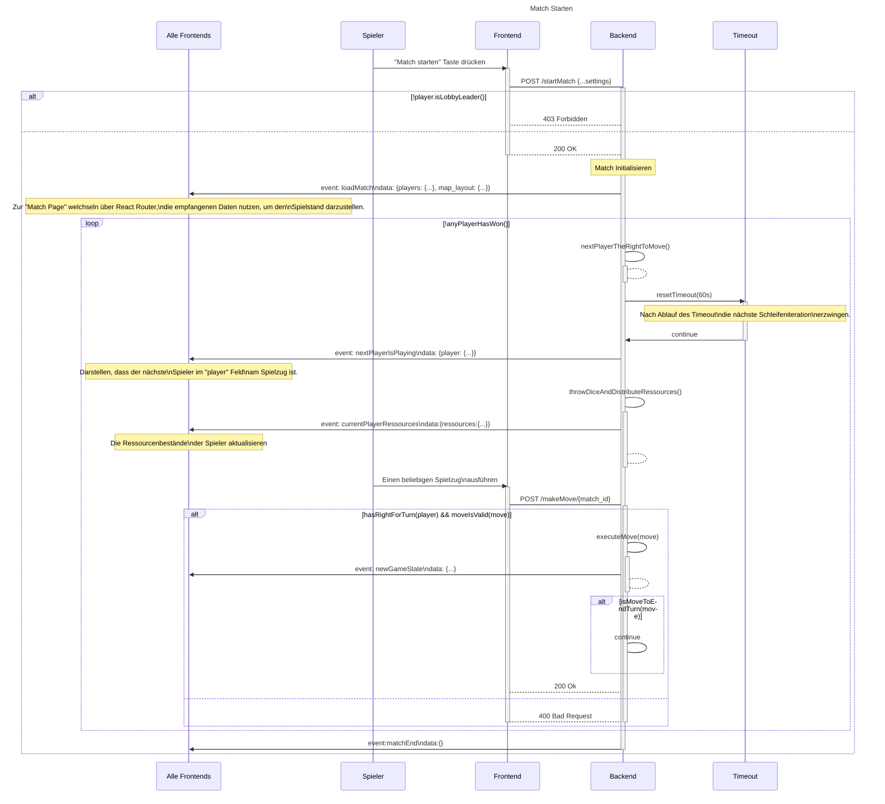

# Use-Case Anforderung: Aktualisierung und Datenaustausch

# 1. Aktualisierung und Datenaustausch

## 1.1 Kurze Beschreibung
Dieses Use-Case dient zur Anzeige des aktuellen Spielstandes auf der Seite des Clients. Demnach ist sie rein technisch basiert und wird im Hintergrund aktiviert. 
Zu den Ereignissen, die die Aktualisierung auslösen, gehören unter anderem:
- Den Wechsel des spielenden Spielers
- Das erhalten von neuen Ressourcen nach dem Würfeln
- Das ausführen eines Spielzugs
- Übertragung der Rolle des Spielleiters
- Wenn ein Spieler das Match beitritt oder verlässt
- etc.

## 1.2 Mockup 
n/a

# 2. Ablauf von Ereignissen

## 2.1 Grundlegender Ablauf
Dieser Ablauf beschreibt den vom Backend ausgeführten Prozess, um sicherzustellen, dass alle Clients immer den aktuellen Spielzustand anzeigen. Der Prozess besteht aus diesen Schritten in dieser Reihenfolge:
1. Der Spielzustand ändert sich
2. Der Server sendet das update an allen beteiligten Spielern
3. Die Clients nehmen die neuen Daten auf, evtl. ändert sich die "Match Page"

Im folgenden Sequenzdiagram sind unteranderem auch die Funktionalitäten dieses Use-Case enthalten:

*Kopie aus [match_starten.md: Sequenzdiagramm](./../match_starten/match_starten.md#sequenzdiagramm)*

## 2.2 Alternative Abläufe
n/a

# 3. Besondere Anforderungen
n/a

# 4. Vorbedingungen
- Mindestens ein Client muss mit dem Match verbunden sein, an den das Backend die Daten senden kann
- eine Veränderung des Spielstandes muss auftreten, um den Datenaustausch auszulösen

# 5. Nachbedingungen
Jeder Client muss (immer) den aktuellen Spielzustand für den Spieler anzeigen.

# 6. Story Points
