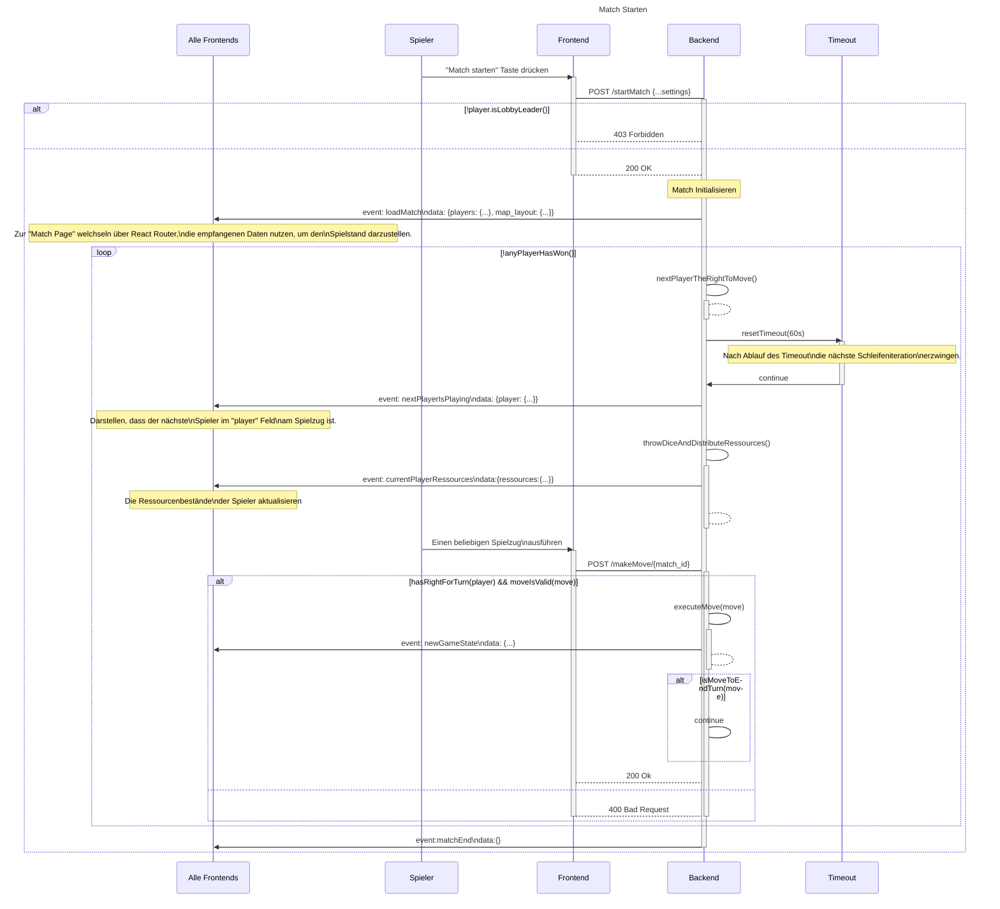

# Use-Case Anforderung: Spielzug Ausführen

# 1. Spielzug Ausführen

## 1.1 Kurze Beschreibung
Dieses Use-Case ermöglicht einem Spieler das Ausführen seines/ihres Spielzuges innerhalb eines Matches.
Beispielsweise ermöglicht das Use-Case somit folgende Spielzüge:
- Die Platzierung von neuen Gebäuden
- Eine Tauschanfrage mit einem Spieler
- Das Handeln mit der Bank
- Das manuelle beenden eines Spielzugs

## 1.2 Mockup 
n/a

# 2. Ablauf von Ereignissen

## 2.1 Grundlegender Ablauf
1. Das Backend erteilt einem Spieler das Zugrecht, ein Timeout wird gestartet
2. Es wird automatisch gewürfelt, basierend auf der gewürfelten Zahl erhalten die Spieler Ressourcen von den Feldern.
3. Solange der Timeout nicht getriggert wurde und der Spieler seinen Zug nicht beendet, kann der Spieler beliebig viele Spielzüge spielen, solange sie valide sind.
4. Nachdem der zugewiesene Spieler seinen Spielzug beendet hat, wird geprüft, ob irgendein Spieler innerhalb des Matches genügend Siegespunkte erreicht hat
5. Wenn ja, beende das Match
6. Wenn nein, soll das Backend das Zugrecht an den nächsten Spieler in der Reihe zuweisen, im folgenden wiederholt sich der Ablauf von Punkt 1.

In dem folgenden Sequenzdiagram wird unteranderem auch den Ablauf für Spielzüge dargestellt:

*Kopie aus [match_starten.md: Sequenzdiagramm](./../match_starten/match_starten.md#sequenzdiagramm)*

## 2.2 Alternative Abläufe
Unvalide bzw. unberechtigte Spielzüge die von einem Client gesendet werden, sollen abgelehnt und mit einer entsprechenden Fehlernachricht beantwortet werden.

# 3. Besondere Anforderungen
n/a

# 4. Vorbedingungen
Es gelten folgende Vorbedingungen:
- Der Spieler muss sich in einem Match befinden
- Der Spieler muss an der Reihe sein
- Der Spielzug muss valide sein

# 5. Nachbedingungen
- Der Spielzug muss ausgeführt werden
- Jede änderung des Spielzustandes muss an alle Clients gesendet werden, sodass sie den neuen Zustand anzeigen können
- 
# 6. Story Points
