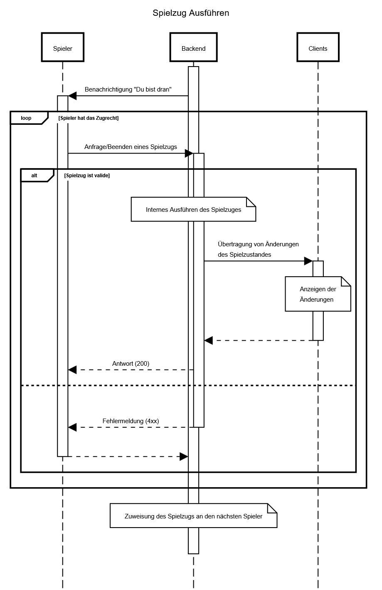

# Use-Case Anforderung: Spielzug Ausführen

# 1. Spielzug Ausführen

## 1.1 Kurze Beschreibung
Dieses Use-Case ermöglicht einem Spieler das Ausführen seines/ihres Spielzuges innerhalb eines Matches.
Beispielsweise ermöglicht das Use-Case somit folgende Spielzüge:
- Die Platzierung von neuen Gebäuden
- Eine Tauschanfrage mit einem Spieler
- Das Handeln mit der Bank

## 1.2 Mockup 
n/a

# 2. Ablauf von Ereignissen

## 2.1 Grundlegender Ablauf
1. Der Spieler erhält die Nachricht, dass er/sie am Spielzug ist.
2. Spieler führt Spielzüge aus.
3. Spieler beendet den Spielzug manuell oder die Zeit läuft ab.

## 2.2 Alternative Abläufe
n/a

# 3. Besondere Anforderungen
n/a

# 4. Vorbedingungen
Es gelten folgende Vorbedingungen:
1. Der Spieler muss sich in einem Match befinden
2. Der Spieler muss an der Reihe sein

# 5. Nachbedingungen
Der nächste Spieler in der Reihenfolge muss die Erlaubniss erhalten, seinen/ihren Spielzug auszuführen.

# 6. Story Points
