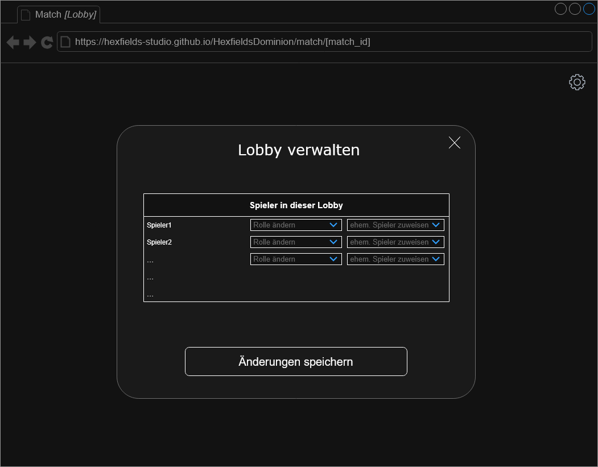
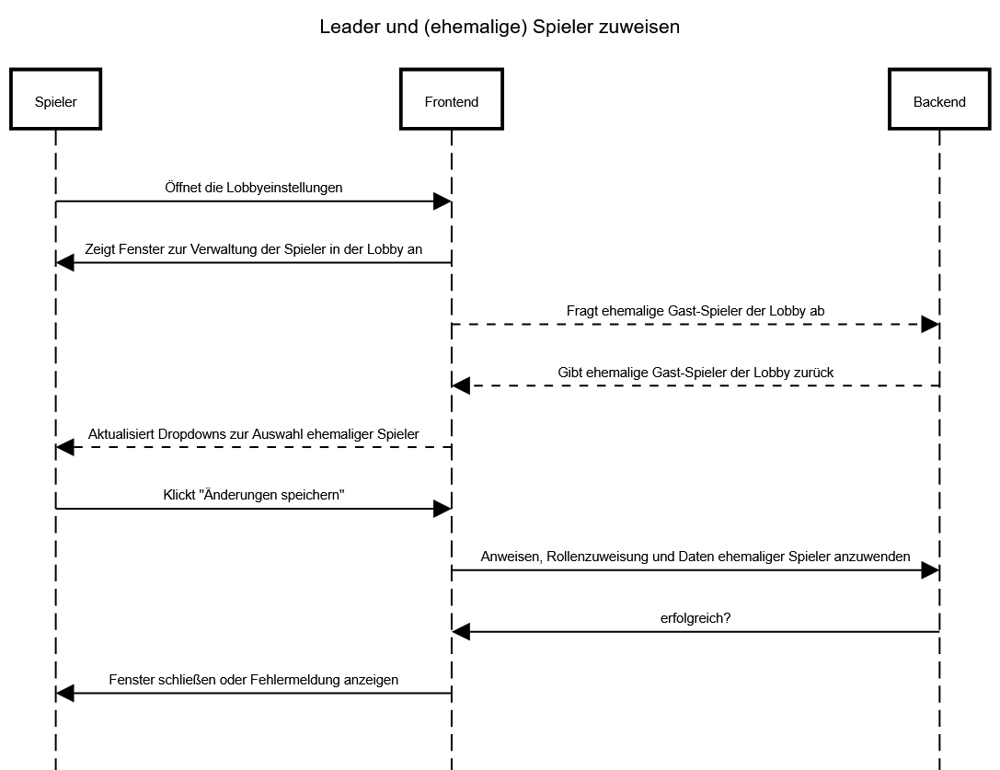

# Use-Case Anforderung: Leader und (ehemalige) Spieler zuweisen

# 1. Leader und (ehemalige) Spieler zuweisen

## 1.1 Kurze Beschreibung
Dieses Use-Case dient einerseits dazu, dass Leader einer Lobby die Leader-Rolle an andere Spieler weitergeben können. Außerdem sollen Leader Spielern Spieldaten von ehemaligen Spielern zuweisen können, falls diese versehentlich das Spiel verlassen haben und als Gast gespielt haben.

## 1.2 Mockup

# 2. Ablauf von Ereignissen

## 2.1 Ereignisse
- Die User öffnen die Lobbyeinstellungen
- Das Frontend zeigt das Fenster zur Verwaltung der Spieler in der Lobby an
- Parallel fragt das Frontend ehemalige Gast-Spieler der Lobby ab, die vom Backend zurückgegeben werden. Darauf hin werden die Dropdowns zur Auswahl ehemaliger Spieler aktualisiert
- Die User klicken auf "Änderungen speichern"
- Das Frontend schickt die Änderungen an das Backend, das diese anwendet
- Das Backend gibt zurück, ob das erfolgreich geschehen ist
- Wenn es erfolgreich war, schließt das Frontend das Fenster. Andernfalls zeigt es eine Fehlermeldung an

### Sequenzdiagramm

## 2.2 Alternative Abläufe
n/a

# 3. Spezielle Anforderungen
n/a

# 4. Vorbedingungen
1. Die User haben die Anwendung geöffnet.
2. Die User sind Leader in dem Match, in welchem sie Aktionen vornehmen wollen.

# 5. Nachbedingungen
1. Wenn die Leader-Rolle neu zugewiesen wurde, besitzt nur der neue Leader diese Rolle.
2. Falls Spieldaten ehemaliger Spieler Spielern im Match zugewiesen wurden, können diese nicht mehr weiteren Spielern zugewiesen werden. Außerdem wurden dann dem Spieler im Match alle Daten übertragen, die für das Match relevant sind.

# 6. Aufwandsschätzung
Story Points: 8
