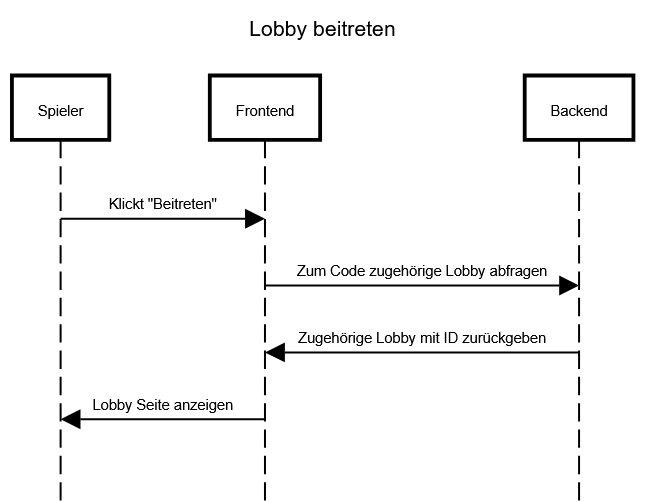

# Use-Case Anforderung: Lobby beitreten

# 1. Lobby beitreten

## 1.1 Kurze Beschreibung
Dieses Use-Case dient dazu, dass User einer bestehenden Lobby beitreten können. Dabei ist egal, ob sie mit Account oder als Gast angemeldet sind. Dafür benötigen sie den entsprechenden Lobbycode.

## 1.2 Mockup

# 2. Ablauf von Ereignissen

## 2.1 Ereignisse
- Die User klicken auf "Beitreten"
- Das Frontend fragt beim Backend die zum Code zugehörige Lobby ab
- Das Backend gibt die zugehörige Lobby und die ID zurück
- Die User werden zur Lobby Seite weitergeleitet

### Sequenzdiagramm

## 2.2 Alternative Abläufe
n/a

# 3. Spezielle Anforderungen
n/a

# 4. Vorbedingungen
1. Die User haben die Anwendung geöffnet.
2. Die User haben sich mit Account oder als Gast angemeldet.
3. Die User haben im Start Menü auf "Lobby beitreten" geklickt.

# 5. Nachbedingungen
1. Die User werden zur entsprechenden Lobby weitergeleitet.
2. Falls die Lobby bereits in einem Match ist, werden die User zu dem entsprechenden Match weitergeleitet.

# 6. Aufwandsschätzung
Story Points: 5
