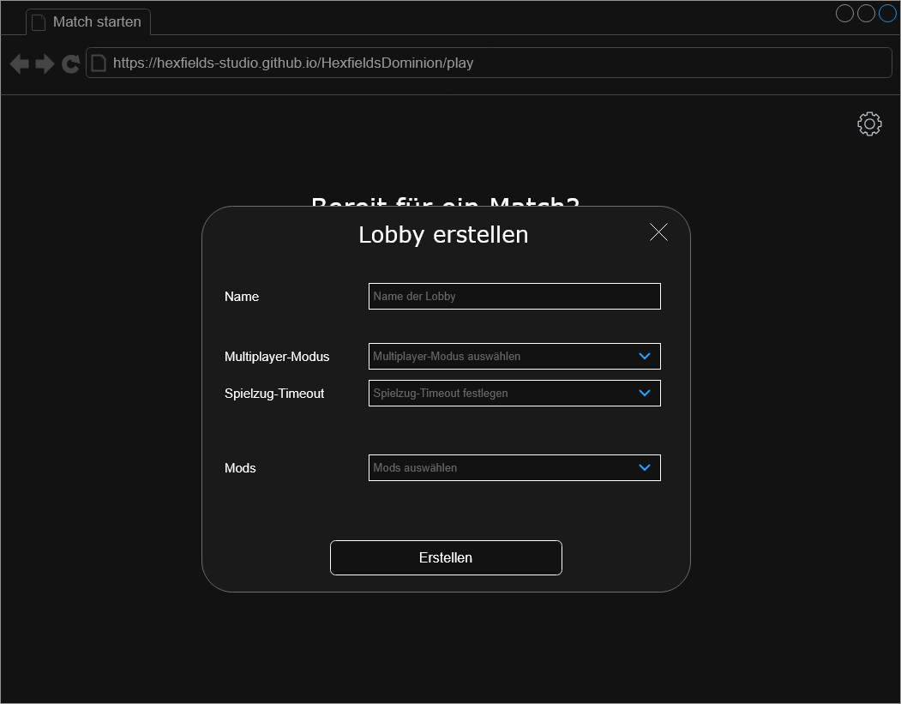
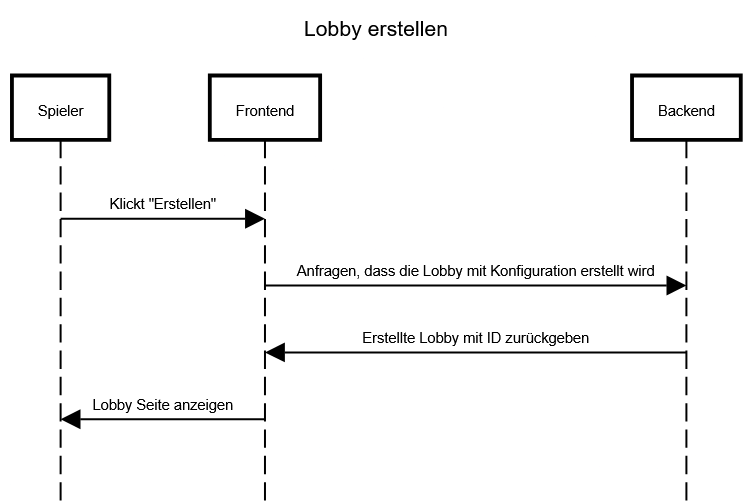

# Use-Case Anforderung: Lobby erstellen

# 1. Lobby erstellen

## 1.1 Kurze Beschreibung
Dieses Use-Case dient dazu, dass User eine neue Lobby erstellen können.

## 1.2 Mockup

# 2. Ablauf von Ereignissen

## 2.1 Ereignisse
- Die User klicken auf "Erstellen"
- Das Frontend fragt beim Backend an, dass die Lobby mit der gewählten Konfiguration erstellt wird
- Das Backend gibt die erstellte Lobby und die ID zurück
- Die User werden zur Lobby Seite weitergeleitet

### Sequenzdiagramm

## 2.2 Alternative Abläufe
n/a

# 3. Spezielle Anforderungen
n/a

# 4. Vorbedingungen
1. Die User haben die Anwendung geöffnet.
2. Die User haben sich mit einem Account angemeldet.
3. Die User haben im Start Menü auf "Lobby erstellen" geklickt.

# 5. Nachbedingungen
Die User werden zur erstellten Lobby weitergeleitet.

# 6. Aufwandsschätzung
Story Points: 8
