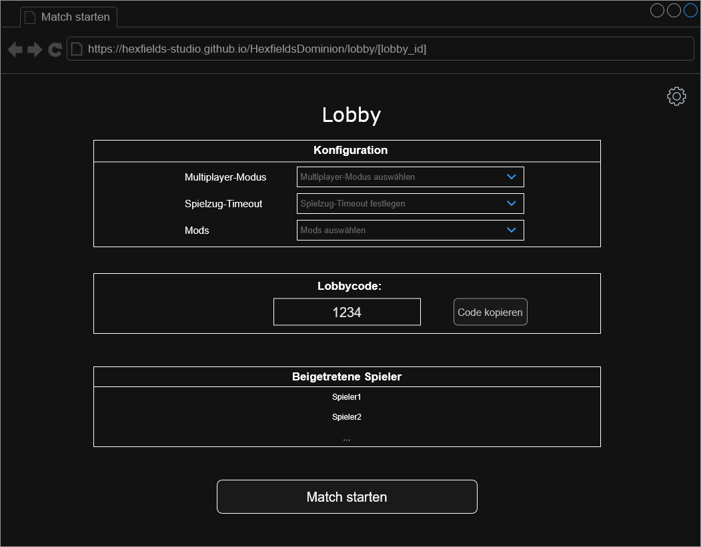
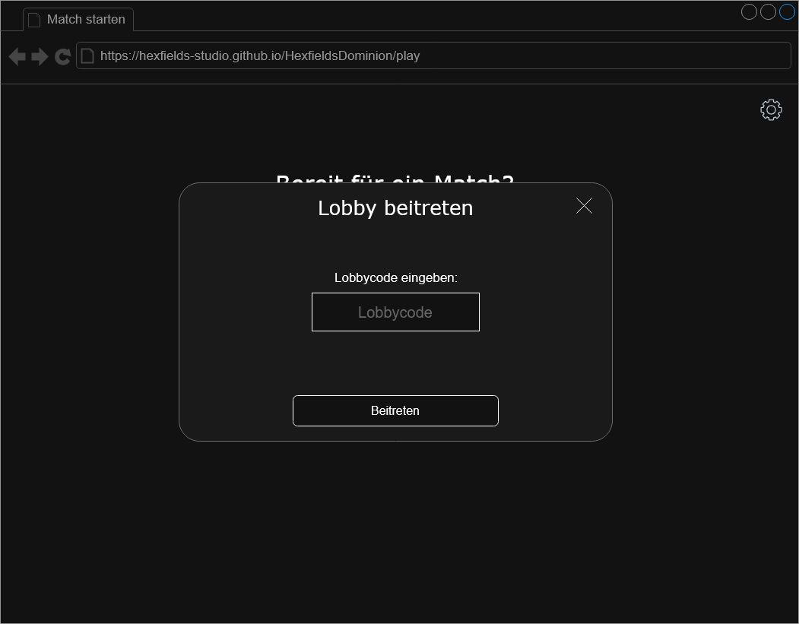
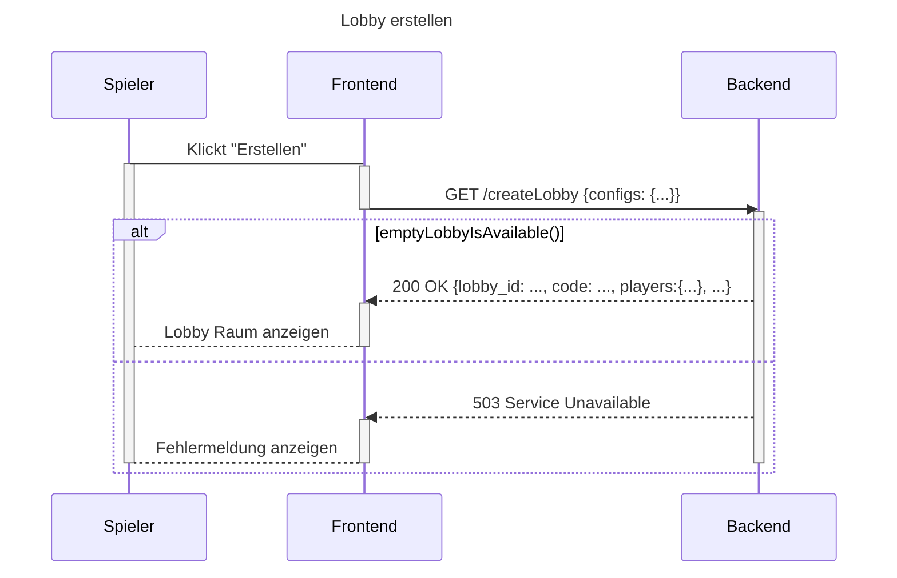
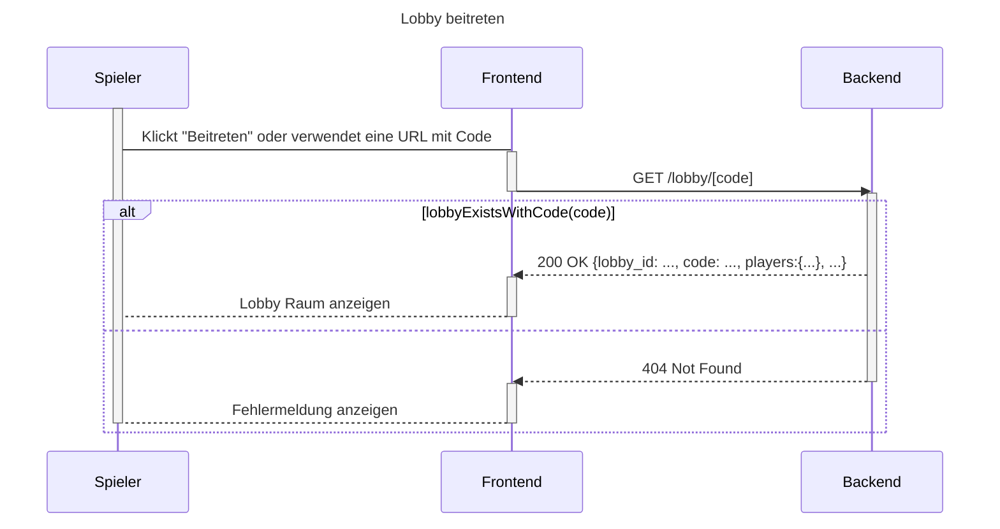

# Use-Case Anforderung: Lobby erstellen und beitreten

# 1. Lobby erstellen und beitreten

## 1.1 Kurze Beschreibung
Dieses Use-Case dient dazu, dass User eine neue Lobby erstellen können. Außerdem sollen sie einer bestehenden Lobby beitreten können.  
Dabei ist egal, ob sie mit einem Account oder als Gast angemeldet sind und für den Beitritt benötigen sie lediglich den entsprechenden Lobbycode.

## 1.2 Mockup

## 1.3 Aktivitätsdiagramm

# 2. Ablauf von Ereignissen

## 2.1 Grundlegender Ablauf
1. Ein User klickt auf “Erstellen”
2. Das Frontend fragt beim Backend an, um eine freie Lobby zu finden und die vom User angegebenen Konfigurationen anzuwenden.
3. Der User wird zur Lobby Seite weitergeleitet

### Sequenzdiagramm

## 2.2 Alternative Abläufe
1. Der User klickt auf "Beitreten"
2. Das Frontend fragt beim Backend die zum Code zugehörige Lobby ab
3. Der User wird zur Lobby Seite weitergeleitet

### Sequenzdiagramm

### Vorbedingungen
1. Die User haben die Anwendung geöffnet.
2. Die User haben sich mit Account oder als Gast angemeldet.
3. Die User haben im Start Menü auf "Lobby beitreten" geklickt.

### Nachbedingungen
1. Die User werden zur entsprechenden Lobby weitergeleitet.
2. Falls die Lobby bereits in einem Match ist, werden die User zu dem entsprechenden Match weitergeleitet.

# 3. Spezielle Anforderungen
n/a

# 4. Vorbedingungen
1. Die User haben die Anwendung geöffnet.
2. Die User haben sich mit Account oder als Gast angemeldet.
3. Die User haben im Start Menü auf "Lobby erstellen" geklickt.

# 5. Nachbedingungen
Die User werden zur erstellten Lobby weitergeleitet.

# 6. Aufwandsschätzung
Story Points: 13
