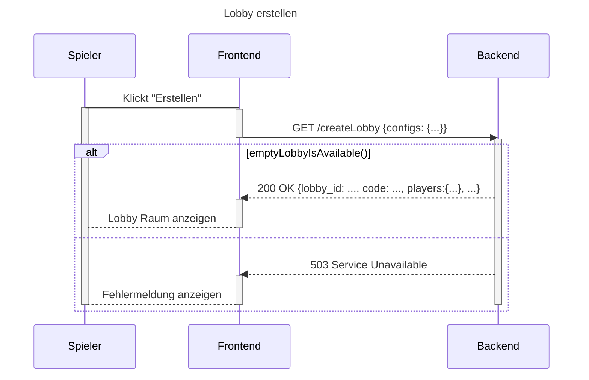
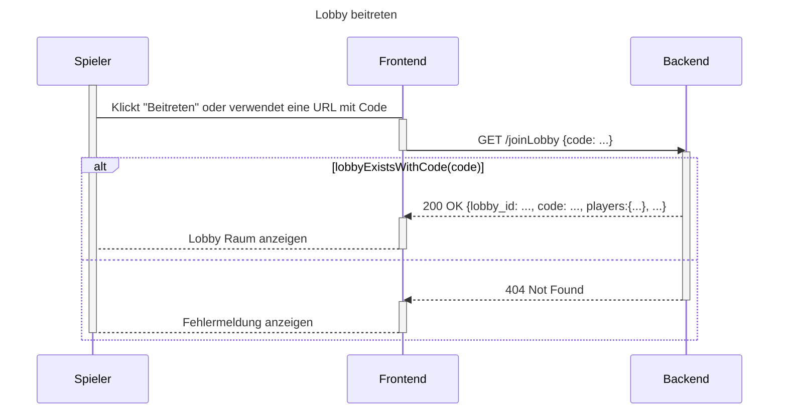

# Use Case Realization Specification: Lobby erstellen und beitreten - Version 1.0

## Revision History

| Date | Version | Description | Author |
| ----- | ----- | ----- | ----- |
| 24/10/2025 | 1.0 | Initial Document | Alex, Jona, Marcel |

## Table of Contents

- [Use Case Realization Specification: Lobby erstellen und beitreten - Version 1.0](#use-case-realization-specification-lobby-erstellen-und-beitreten---version-10)
  - [Revision History](#revision-history)
  - [Table of Contents](#table-of-contents)
  - [1. Introduction](#1-introduction)
    - [1.1. Purpose](#11-purpose)
    - [1.2. Scope](#12-scope)
    - [1.3. Definitions, Acronyms, and Abbreviations](#13-definitions-acronyms-and-abbreviations)
    - [1.4. References](#14-references)
    - [1.5. Overview](#15-overview)
  - [2. Flow of Events - Design](#2-flow-of-events---design)
    - [2.1. Grundlegender Ablauf - Erstellen der Lobby](#21-grundlegender-ablauf---erstellen-der-lobby)
      - [Sequenzdiagramm (Mermaid) - Erstellen der Lobby](#sequenzdiagramm-mermaid---erstellen-der-lobby)
    - [2.2. Grundlegender Ablauf - Beitreten einer Lobby](#22-grundlegender-ablauf---beitreten-einer-lobby)
      - [Sequenzdiagramm (Mermaid) - Beitreten einer Lobby](#sequenzdiagramm-mermaid---beitreten-einer-lobby)
  - [3. Derived Requirements](#3-derived-requirements)
    - [Weitere Anforderungen](#weitere-anforderungen)

## 1. Introduction

### 1.1. Purpose

Dieses Use-Case dient dazu, dass User eine neue Lobby erstellen können. Dafür müssen sie mit einem Account angemeldet sein.  
Außerdem sollten sie einer bestehenden Lobby beitreten können. Dabei ist egal, ob sie mit einem Account oder als Gast angemeldet sind, sie benötigen lediglich den entsprechenden Lobby Code.

### 1.2. Scope

Das Use-Case "Lobby erstellen und beitreten" ist mit den Use-Cases "Start Menü" und "Match Starten" assoziiert.

### 1.3. Definitions, Acronyms, and Abbreviations

"Erstellen einer Lobby" --> Beitreten einer bereits existierenden Lobby. Der Spieler soll das Gefühl haben, als ob er eine Lobby selbst erstellt hat.

### 1.4. References

- [Use-Case Spezifikation Lobby erstellen und beitreten, Sequenzdiagramm](https://github.com/Hexfields-Studio/HexfieldsDominion-Artefacts/blob/main/srs/lobby_management/lobby_erstellen_bearbeiten/lobby_erstellen_beitreten.md)  
- [Aktivitätsdiagramm](https://github.com/Hexfields-Studio/HexfieldsDominion-Artefacts/blob/main/srs/lobby_management/lobby_erstellen_bearbeiten/aktivit%C3%A4tsdiagramm.png)

### 1.5. Overview

Dieses Use-Case besteht aus zwei verschiedenen Abläufen: die Erstellung einer Lobby und das Beitreten einer bereits existierenden Lobby. In Kapitel 2 werden beide verschiedene Abläufe beschrieben.

## 2. Flow of Events - Design

Dieses Use-Case besteht aus zwei verschiedenen Abläufen: die Erstellung einer Lobby und das Beitreten einer bereits existierenden Lobby. Beide Abläufe sind nahezu identisch und werden im Folgenden Beschrieben:

### 2.1. Grundlegender Ablauf - Erstellen der Lobby

Dieser Ablauf beschreibt den Prozess, der von einem Spieler für die Erstellung einer Lobby ausgeführt wird. Der Prozess besteht aus diesen Schritten in dieser Reihenfolge:

1. Ein User klickt auf "Erstellen"  
2. Das Frontend fragt beim Backend an, um eine freie Lobby zu finden und die vom User angegebenen Konfigurationen anzuwenden.  
3. Das Backend gibt die bereitgestellte Lobby und die ID zurück  
4. Der User wird zur Lobby Seite weitergeleitet

#### Sequenzdiagramm (Mermaid) - Erstellen der Lobby

### 2.2. Grundlegender Ablauf - Beitreten einer Lobby

Dieser Ablauf beschreibt den Prozess, der von einem Spieler für den Beitritt einer existierenden Lobby ausgeführt  
wird. Der Prozess besteht aus diesen Schritten in dieser Reihenfolge:

1. Der User klickt auf "Beitreten"  
2. Das Frontend fragt beim Backend die zum Code zugehörige Lobby ab  
3. Das Backend gibt die zugehörige Lobby und die ID zurück  
4. Der User wird zur Lobby Seite weitergeleitet

#### Sequenzdiagramm (Mermaid) - Beitreten einer Lobby

## 3. Derived Requirements

### Weitere Anforderungen  

- Ein Spieler „erstellt" in der Realität keine Lobby. Sondern er tritt einer vom Backend bereitgestellten Lobby bei. Dadurch soll ein DDOS-Angriff verhindert werden, der aus der Bedrohung besteht, dass ein Spieler unendlich viele Lobbys erstellen könnte.  
- Das Backend soll nach dem Starten eine festgelegte Anzahl von Lobbys bereitstellen.
