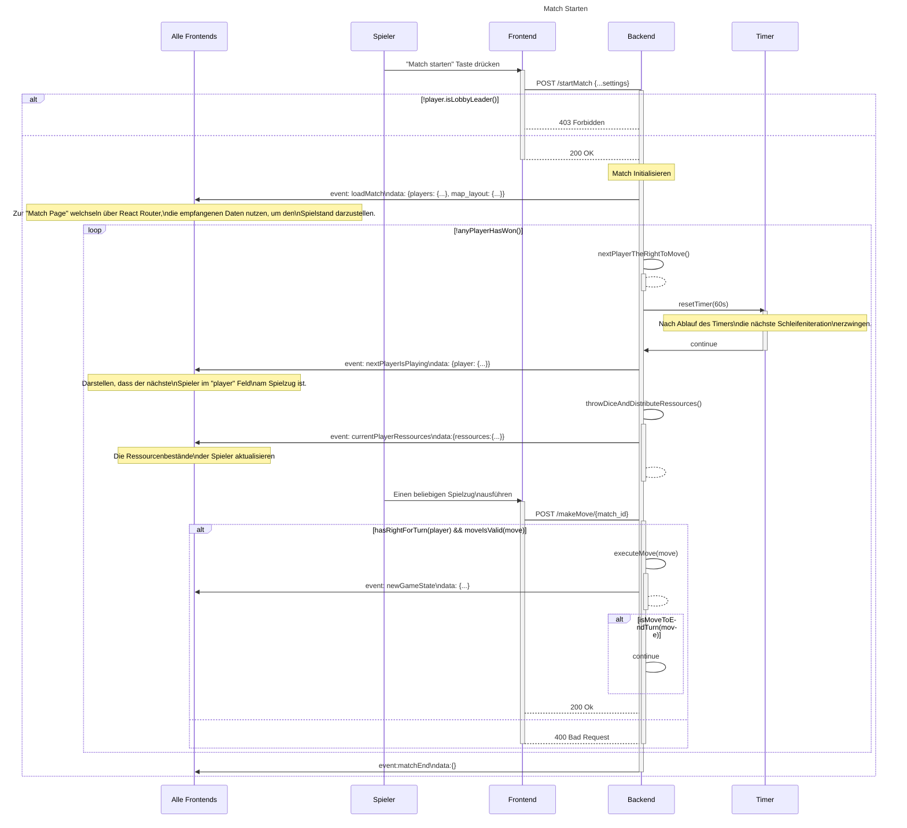

# Use-Case Anforderung: Match starten

# 1. Match starten

## 1.1 Kurze Beschreibung
Dieses Use-Case dient dazu, dass ein User (der Lobbyanführer) ein Match starten kann. Dabei wird eine bestehende Lobby benötigt, auf der das Match aufbaut.

## 1.2 Mockup

# 2. Ablauf von Ereignissen

## 2.1 Grundlegender Ablauf
Dieser Ablauf beschreibt den Prozess, der von einem Spieler (den Lobbyanführer) das starten eines Matches ausgeführt wird. Der Prozess besteht aus diesen Schritten in dieser Reihenfolge:
1. Ein User klickt auf "Match starten"
2. Das Frontend sendet eine Anfrage an das Backend um ein Match auf Grundlage der Lobby zu starten
3. Solange das Match läuft, überträgt das Backend die Daten des matches an alle Clients innerhalb der Lobby

## 2.2 Alternative Abläufe
Im Falle eines Fehlers (sollte der Spieler nicht der Lobbyanführer sein) sollte eine entsprechende Fehlermeldung zurückgesendet werden.

Das folgende Sequenzdiagramm beschreibt beide Abläufe:

# 3. Spezielle Anforderungen
n/a

# 4. Vorbedingungen
Für das Starten des Matches gelten folgende Vorbedingungen:
1. Der User hat die Rolle des Lobbyanführers
2. Es befinden sich genügend Spieler innerhalb der Lobby
3. Die Konfigurationen sind valide

# 5. Nachbedingungen
1. Ein Match wurde auf Grundlage der Lobby erstellt.
2. Alle Mitglieder der Lobby wurden zu diesem Match weitergeleitet und habe.

# 6. Aufwandsschätzung
Story Points: 8
