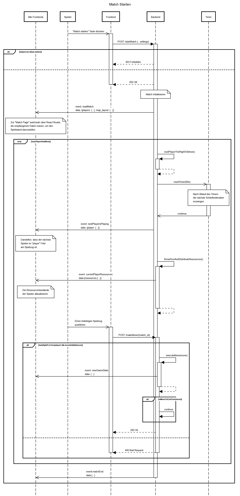

# Use-Case Anforderung: Match starten

# 1. Match starten

## 1.1 Kurze Beschreibung
Dieses Use-Case dient dazu, dass ein User (der Lobbyanführer) ein Match starten kann. Dabei wird eine bestehende Lobby benötigt, auf der das Match aufbaut.

## 1.2 Mockup


# 2. Ablauf von Ereignissen

## 2.1 Grundlegender Ablauf
1. Die User klicken auf "Match starten"
2. Das Frontend fragt beim Backend an, dass ein Match auf Grundlage der Lobby erstellt wird
3. Das Backend gibt das zugehörige Match und die ID zurück
4. Alle Spieler in der Lobby werden zur Match Seite weitergeleitet

### Sequenzdiagramm
```
sequenceDiagram
title Match Starten

participant Alle Frontends
participant Spieler
participant Frontend
participant Backend
participant Timer


Spieler->>Frontend:"Match starten" Taste drücken
activate Frontend
  Frontend->Backend: POST /startMatch {...settings}
  activate Backend
    alt !player.isLobbyLeader()
      Frontend<--Backend: 403 Forbidden
    else
      Frontend<--Backend: 200 OK
      deactivate Frontend
      note over Backend:Match Initialisieren
      Alle Frontends<<-Backend: event: loadMatch\ndata: {players: {...}, map_layout: {...}}
        note over Alle Frontends:Zur "Match Page" welchseln über React Router,\ndie empfangenen Daten nutzen, um den\nSpielstand darzustellen.
      loop !anyPlayerHasWon()
        Backend->Backend: nextPlayerTheRightToMove()
        activate Backend
          Backend<--Backend:
        deactivate Backend
        Backend->>Timer: resetTimer(60s)
        activate Timer
          note over Timer: Nach Ablauf des Timers\ndie nächste Schleifeniteration\nerzwingen.
          Backend<<-Timer: continue
        deactivate Timer
        Alle Frontends <<- Backend: event: nextPlayerIsPlaying\ndata: {player: {...}}
        note over Alle Frontends: Darstellen, dass der nächste\nSpieler im "player" Feld\nam Spielzug ist.
        Backend->Backend: throwDiceAndDistributeRessources()
        activate Backend
          Alle Frontends <<- Backend: event: currentPlayerRessources\ndata:{ressources:{...}}
          note over Alle Frontends:Die Ressourcenbestände\nder Spieler aktualisieren
          Backend <-- Backend:
        deactivate Backend
        
        Spieler ->> Frontend: Einen beliebigen Spielzug\nausführen
        activate Frontend
          Frontend->Backend: POST /makeMove/{match_id}
          activate Backend
            alt hasRightForTurn(player) && moveIsValid(move)
              Backend->Backend: executeMove(move)
              activate Backend
                Alle Frontends <<- Backend: event: newGameState\ndata: {...}
                Backend<--Backend:
                
              deactivate Backend
              alt isMoveToEndTurn(move)
                Backend->Backend: continue
              end
              Frontend<--Backend: 200 Ok
            else
              Frontend<--Backend: 400 Bad Request
              deactivate Backend
              deactivate Frontend
            end
      end
      Alle Frontends<<-Backend: event:matchEnd\ndata:{}
      deactivate Backend
    end
  deactivate Backend
deactivate Frontend
```

## 2.2 Alternative Abläufe
n/a

# 3. Spezielle Anforderungen
n/a

# 4. Vorbedingungen
1. Die User haben die Anwendung geöffnet.
2. Die User haben eine Lobby erstellt.
3. Mindestens ein Mitspieler ist der Lobby beigetreten.

# 5. Nachbedingungen
1. Ein Match wird auf Grundlage der Lobby erstellt.
2. Alle Mitglieder der Lobby werden zu diesem Match weitergeleitet.

# 6. Aufwandsschätzung
Story Points: 8
