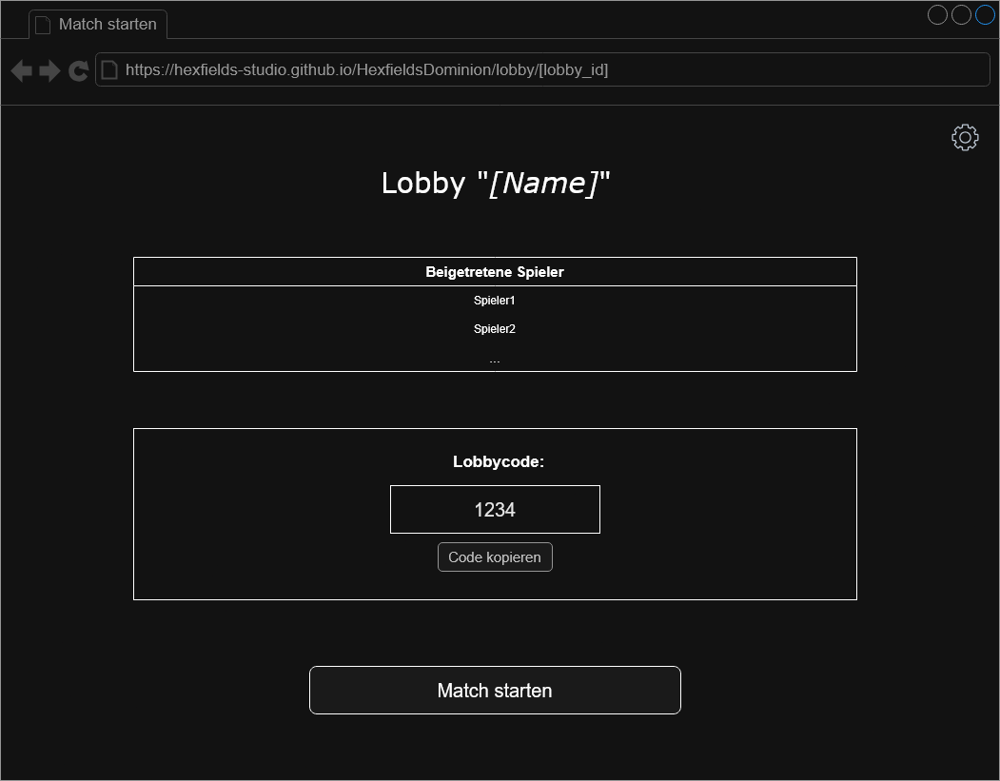
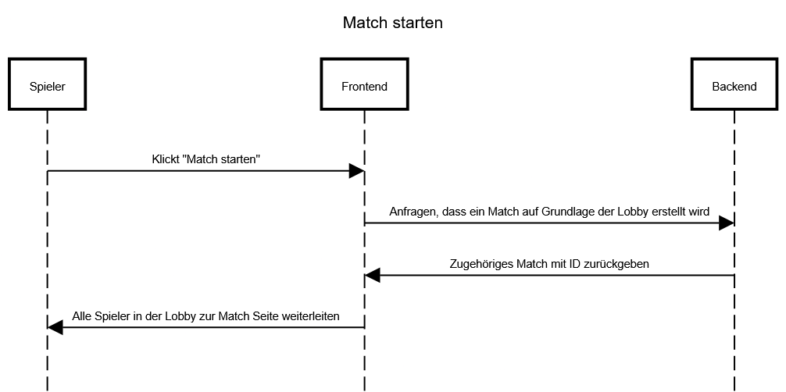

# Use-Case Anforderung: Match starten

# 1. Match starten

## 1.1 Kurze Beschreibung
Dieses Use-Case dient dazu, dass User ein Match starten können. Dabei wird eine bestehende Lobby benötigt, auf der das Match aufbaut.

## 1.2 Mockup

# 2. Ablauf von Ereignissen

## 2.1 Ereignisse
- Die User klicken auf "Match starten"
- Das Frontend fragt beim Backend an, dass ein Match auf Grundlage der Lobby erstellt wird
- Das Backend gibt das zugehörige Match und die ID zurück
- Alle Spieler in der Lobby werden zur Match Seite weitergeleitet

### Sequenzdiagramm

## 2.2 Alternative Abläufe
n/a

# 3. Spezielle Anforderungen
n/a

# 4. Vorbedingungen
1. Die User haben die Anwendung geöffnet.
2. Die User haben eine Lobby erstellt.
3. Mindestens ein Mitspieler ist der Lobby beigetreten.

# 5. Nachbedingungen
1. Ein Match wird auf Grundlage der Lobby erstellt.
2. Alle Mitglieder der Lobby werden zu diesem Match weitergeleitet.

# 6. Aufwandsschätzung
Story Points: 8
