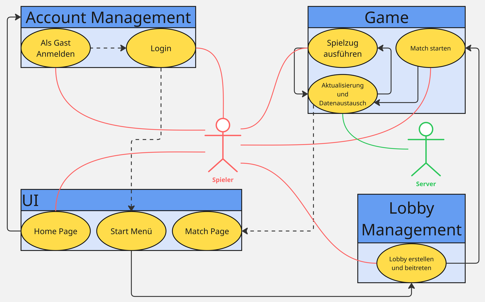

# **Software Requirements Specification (SRS) - Version 1.1**

## **Revision History**

| Date | Version | Description | Author |
|------|---------|-------------|--------|
| 18/Oct/2025 | 0.9 | Dokumenten-Struktur | Alex, Jona, Marcel |
| 20/Oct/2025 | 1.0 | Use-Cases hinzugefügt | Alex, Jona, Marcel |
| 20/Oct/2025 | 1.1 | Diagramme hinzugefügt | Alex, Marcel |

## **Inhaltsverzeichnis**

- [**Software Requirements Specification (SRS) - Version 1.1**](#software-requirements-specification-srs---version-11)
  - [**Revision History**](#revision-history)
  - [**Inhaltsverzeichnis**](#inhaltsverzeichnis)
  - [1. Einleitung](#1-einleitung)
    - [1.1 Zweck](#11-zweck)
    - [1.2 Umfang](#12-umfang)
      - [**Akteure der Anwendung**](#akteure-der-anwendung)
      - [**Geplante Subsysteme**](#geplante-subsysteme)
    - [1.3 Definitionen, Akronyme und Abkürzungen](#13-definitionen-akronyme-und-abkürzungen)
    - [1.4 Referenzen](#14-referenzen)
    - [1.5 Übersicht](#15-übersicht)
  - [2. Allgemeine Beschreibung](#2-allgemeine-beschreibung)
    - [2.1 Vision](#21-vision)
    - [2.2 Use-Case-Diagramm](#22-use-case-diagramm)
    - [2.3 Technologie-Stack](#23-technologie-stack)
      - [**Frontend**](#frontend)
      - [**Backend**](#backend)
      - [**Development \& Operations**](#development--operations)
    - [2.4 Teamstruktur und Verantwortlichkeiten](#24-teamstruktur-und-verantwortlichkeiten)
  - [3. Spezifische Anforderungen](#3-spezifische-anforderungen)
    - [3.1 Funktionalität](#31-funktionalität)
      - [Phase 1 (bis Dezember) - Kernfunktionalität](#phase-1-bis-dezember---kernfunktionalität)
      - [Phase 2 (bis Juni) - Erweiterungen](#phase-2-bis-juni---erweiterungen)
    - [Funktionale Anforderungen im Detail](#funktionale-anforderungen-im-detail)
    - [3.2 Benutzbarkeit](#32-benutzbarkeit)
    - [3.3 Zuverlässigkeit](#33-zuverlässigkeit)
    - [3.4 Leistung](#34-leistung)
    - [3.5 Wartbarkeit](#35-wartbarkeit)
    - [3.6 Design-Einschränkungen](#36-design-einschränkungen)
      - [Unterstützte Browser](#unterstützte-browser)
      - [Architektur](#architektur)
    - [3.7 Online-Benutzerdokumentation und Hilfesystem](#37-online-benutzerdokumentation-und-hilfesystem)
    - [3.8 Gekaufte Komponenten](#38-gekaufte-komponenten)
    - [3.9 Schnittstellen](#39-schnittstellen)
      - [3.9.1 Benutzerschnittstellen](#391-benutzerschnittstellen)
      - [3.9.2 Software-Schnittstellen](#392-software-schnittstellen)
    - [3.10 Lizenzanforderungen](#310-lizenzanforderungen)
    - [3.11 Rechtliche Hinweise, Urheberrecht und Sonstiges](#311-rechtliche-hinweise-urheberrecht-und-sonstiges)
    - [3.12 Anwendbare Standards](#312-anwendbare-standards)
  - [4. Unterstützende Informationen](#4-unterstützende-informationen)

## 1. Einleitung

### 1.1 Zweck

Diese Software-Anforderungsspezifikation dient zur Definition von funktionellen und nicht funktionellen Anforderungen für das Videospiel “Hexfields: Dominion”. Dieses Dokument ist für die Entwickler, es bietet eine detaillierte Beschreibung des Spielverhaltens und des Designs, um ein gemeinsames Verständnis des Systems zu gewährleisten.

### 1.2 Umfang

Das Projekt wird als responsive Webanwendung realisiert, die in modernen Browsern läuft.

#### **Akteure der Anwendung**

- Spieler (registriert und als Gast)
- Lobby-Ersteller (Host)
- Administratoren

#### **Geplante Subsysteme**

- **Account-Management**: Registrierung, Login, Gast-Zugang, Profilverwaltung
- **Lobby-Management**: Spielerstellung, Beitritt per Code, Rollenzuweisung, Spielstart
- **Spiel-Engine**: Vollständige Implementierung der Siedler von Catan Spielmechaniken
- **Echtzeit-Kommunikation**: Datenaustausch zwischen Frontend und Backend während des Spiels
- **Benutzeroberfläche**: Responsive UI mit Spielfeld, Spielzustandsanzeige und Menüsystem

### 1.3 Definitionen, Akronyme und Abkürzungen

| Bezeichnung | Definition |
| :---- | :---- |
| Ressource | Ein Material, das für den Bau von verschiedenen Gebäuden zwischen den Feldern benötigt wird. |
| Gebäude | Verschiedene Gebäude können zwischen den Feldern gebaut werden. Sie ermöglichen es, Ressourcen zu erhalten. |
| Bank | Die Bank ist eine Funktion des Spiels, über die ein Spieler Ressourcen tauschen kann. *Spieler können immer mit der Bank handeln, allerdings mit relativ hohen Kosten. Durch das Bauen von mindestens einem Hafen können diese gesenkt werden.* |
| Feld | Eine Hexagon-förmige Fläche, die visuell eine Ressource darstellt und diese auch an einen Spieler abgeben kann. Jedes individuelle Feld besitzt von Spielbeginn an eine Zahl. |
| Spielfeld | Das Spielfeld besteht aus mehreren Feldern, die direkt aneinander zusammengefügt sind.  |
| Siegespunkt | Ein Spieler sammelt Siegpunkte durch das Erreichen von Zielen. Erreicht ein Spieler eine festgelegte Anzahl von Siegespunkten, gewinnt dieser das Spiel. |
| Ziel | Jedes Ziel besteht aus einer festgelegten Bedingung. Solange ein Spieler diese Bedingung erfüllt, erhält er für das Erreichen des Ziels Siegpunkte. |
| Entwicklung |  |
| Modus | Ein Satz von Spielregeln, es wird beim Starten des Spiels ausgewählt. |
| Würfeln | Jeder Spieler würfelt automatisch am Anfang seines Zuges zwei Würfel. |
| Spielzugphase | Einteilung der aufeinander folgenden Aktionen, wenn ein neuer Spieler am Zug ist. Es gibt die Ertrags-, Handels- und Bauphase. |

### 1.4 Referenzen

| Titel | Änderungsdatum | Organisation |
| :---- | :---- | :---- |
| [GitHub Organisation & Blog](https://github.com/Hexfields-Studio) | 18/Oct/2025 | Hexfields Studio |
| [GitHub Repository: Frontend](https://github.com/Hexfields-Studio/HexfieldsDominion) | 18/Oct/2025 | Hexfields Studio |
| [GitHub Repository: Backend](https://github.com/Hexfields-Studio/HexfieldsDominion-Backend) | 18/Oct/2025 | Hexfields Studio |
| [GitHub Repository: Artefakte](https://github.com/Hexfields-Studio/HexfieldsDominion-Artefacts) | 18/Oct/2025 | Hexfields Studio |
| [GitHub Pages: Webseite](https://hexfields-studio.github.io/HexfieldsDominion/) | 18/Oct/2025 | Hexfields Studio |

### 1.5 Übersicht

 Kapitel 2 bietet eine allgemeine Beschreibung des Projekts mit Vision, Teamstruktur und Technologie-Stack. Das dritte Kapitel (Spezifische Anforderungen) liefert detaillierte Informationen zu den funktionalen und nicht-funktionalen Anforderungen, strukturiert nach den beiden Entwicklungsphasen.

## 2. Allgemeine Beschreibung

### 2.1 Vision

“Hexfields: Dominion” ist ein eigenständiges Videospiel im Multiplayer, das im Webbrowser spielbar ist und somit auf jedem Computer und Smartphone erreichbar ist. Das Spiel soll eine im Web spielbare und leicht zugängliche Alternative zum Brettspiel “Siedler von Catan” sein. Matches zwischen Spielern können sowohl in Echtzeit als auch zugabhängig stattfinden. Dabei bieten sie neben zufälligen Mitspielern auch die Möglichkeit, mit Freunden zusammen zu spielen. Bekannte Bestandteile des originalen Spiels werden mit erweiterten Funktionen und Mechaniken (Mods) ergänzt, sodass ein neues Spielerlebnis entsteht.

### 2.2 Use-Case-Diagramm

**

*Anmerkung: Die alte Version des Use-Case Diagramms ist im Verzeichnis als "[use_case_diagram_old.jpg](./use_case_diagram_old.jpg)" verfügbar.*

### 2.3 Technologie-Stack

#### **Frontend**

- React mit TypeScript
- Vite als Build-Tool
- bun/npm als Package Manager

#### **Backend**

- Java mit Spring Framework
- Gradle als Build-Tool
- PostgreSQL als Datenbank

#### **Development & Operations**

- IDEs: IntelliJ IDEA & VSCode
- Versionsverwaltung: Git/GitHub/GH-Pages
- Projektmanagement: Jira mit Scrum-Methodik
- Testing: JUnit, React Testing Library

### 2.4 Teamstruktur und Verantwortlichkeiten

| Teammitglied | Rolle | Verantwortlichkeiten |
|--------------|-------|---------------------|
| **Alex ([A1exHorst](https://github.com/A1exHorst))** | Product Owner & Frontend Lead | Feature-Priorisierung, Frontend-Architektur, React-Entwicklung |
| **Jona ([JaskerX](https://github.com/JaskerX))** | Use-Case-Reviewer & Backend Lead | Backend-Architektur, Technical Design, Java Spring Entwicklung |
| **Marcel ([ultra-ms](https://github.com/ultra-ms))** | Scrum Master & Infrastructure | Projektorganisation, DevOps, Support, Dokumentation |

## 3. Spezifische Anforderungen

### 3.1 Funktionalität

#### Phase 1 (bis Dezember) - Kernfunktionalität

- **3.1.1 Account Management**  
  Registrierung, Login, Passwort Reset, Gast-Zugang, Logout
- **3.1.2 Lobby Management**  
  Lobby erstellen und beitreten, Rollenzuweisung, Spiel starten
- **3.1.3 Spielmechaniken**  
  Vollständige Implementierung der Spielmechaniken und Mehrspieler-Logik
- **3.1.4 Grundlegende UI**  
  Start- und Spielbildschirm, Anmeldefenster/Homepage

#### Phase 2 (bis Juni) - Erweiterungen

- **3.1.5 Erweiterte UI-Komponenten**  
  Pause-Menü, verbesserte Start- und Spielbildschirme
- **3.1.6 Mods-System**  
  Doppeltes Würfeln, Völker-Fähigkeiten, Riesiges Spielfeld
- **3.1.7 Skins**  
  Antike, Moderne, Magisch, Fliegende Inseln
- **3.1.8 Design-Verbesserungen**  
  Light/Dark Mode, verbesserte Visualisierung

### Funktionale Anforderungen im Detail

- **3.1.1 Account Management**  
  - 3.1.1.1 [Registrierung](./account_management/registration/registration.md)
  - 3.1.1.2 [Login](./account_management/login/login.md)
  - 3.1.1.3 [Passwort Reset](./account_management/password_reset/password_reset.md)
  - 3.1.1.4 [Gast-Login](./account_management/gast_login/gast_login.md)
  - 3.1.1.5 [Logout](./account_management/logout/logout.md)

- **3.1.2 Lobby Management**  
  - 3.1.2.1 [Lobby erstellen und beitreten](lobby_management/lobby_erstellen_beitreten/lobby_erstellen_beitreten.md)
  - 3.1.2.2 [Match starten](lobby_management/REM match_starten/match_starten.md)
  - 3.1.2.3 [Rollenzuweisung](./lobby_management/leader_ehemalige_zuweisung/leader_ehemalige_zuweisung.md)

- **3.1.3 Spielmechaniken**  
  - 3.1.3.1 [Spielzug ausführen](./game/spielzug_ausfuehren/spielzug_ausfuehren.md)
  - 3.1.3.2 [Aktualisierung und Datenaustausch](./game/aktualisierung_und_datenaustausch/aktualisierung_und_datenaustausch.md)
  - 3.1.3.3 [Laufendes Match](./game/laufendes_match/laufendes_match.md)

- **3.1.4 Grundlegende UI**  
  - 3.1.4.1 [Startbildschirm](./user_interface/start_menü/start_menü.md)
  - 3.1.4.2 [Spielbildschirm](./user_interface/match_page/spiel_menue/spiel_menue.md)
  - 3.1.4.3 [Anmeldefenster/Homepage](./user_interface/home_page/home_page.md)

- **3.1.5 Erweiterte UI-Komponenten** *(Anforderungen Work-in-progress)*
  - 3.1.5.1 [Pause-Menü](-)
  - 3.1.5.2 [Verbessertes Startmenü](-)
  - 3.1.5.3 [Verbessertes Spielmenü](-)

- **3.1.6 Mods-System** *(Anforderungen Work-in-progress)*
  - 3.1.6.1 [Doppeltes Würfeln](-)
  - 3.1.6.2 [Völker-Fähigkeiten](-)
  - 3.1.6.3 [Riesiges Spielfeld](-)

- **3.1.7 Skins**  *(Anforderungen Work-in-progress)*
  - 3.1.7.1 [Antike (Standard)](-)
  - 3.1.7.2 [Moderne](-)
  - 3.1.7.3 [Magisch](-)
  - 3.1.7.4 [Fliegende Inseln](-)

- **3.1.8 Design-Verbesserungen**  
  - 3.1.8.1 [Light/Dark Mode](./user_interface/light_dark_mode/light_dark_mode.md)

### 3.2 Benutzbarkeit

- Intuitive Bedienung: Die Oberfläche orientiert sich am originalen Brettspiel-Design, um erfahrenen "Siedler-von-Catan"-Spielern ein vertrautes Gefühl zu vermitteln.
- Responsives Design: Die Webanwendung ist auf Desktop- und Mobilgeräten gleichermaßen gut bedienbar.

### 3.3 Zuverlässigkeit

- Verfügbarkeit: Der Server soll zu 95% der Zeit verfügbar sein. Wartungsarbeiten werden außerhalb der Hauptspielzeiten durchgeführt.
- Datenkonsistenz: Spielstände werden regelmäßig gesichert. Bei Verbindungsabbrüchen können Spieler an ihre vorherige Position zurückkehren.

### 3.4 Leistung

- Antwortzeiten: Spielaktionen werden innerhalb von einer Sekunde visualisiert. Ladezeiten für neue Spiele unter 3 Sekunden.
- Gleichzeitige Benutzer: Das Backend-System ist skalierbar und sollte damit eine beinahe unendliche Anzahl gleichzeitiger Nutzer und Spiele unterstützen.

### 3.5 Wartbarkeit

- Clean Code Standards: Verwendung etablierter TypeScript und Java Coding Conventions und Linter-Einstellungen. Es gibt regelmäßige Code-Reviews im Team.
- Testabdeckung: Mindestens 80% Testabdeckung im Backend, 70% im Frontend. Wöchentliche Integrationstests.

### 3.6 Design-Einschränkungen

#### Unterstützte Browser

- Chrome 90+
- Firefox 88+
- Safari 14+
- Edge 90+

#### Architektur

- Frontend: React mit TypeScript
- Backend: Java Spring mit REST-API
- Datenbank: PostgreSQL
- Responsive Web Design für Mobile Compatibility

### 3.7 Online-Benutzerdokumentation und Hilfesystem

Integriertes Regelwerk und FAQ für neue Spieler. Context-sensitive Hilfe in der Spieloberfläche.

### 3.8 Gekaufte Komponenten

Aktuell sind keine gekauften Komponenten geplant.

### 3.9 Schnittstellen

#### 3.9.1 Benutzerschnittstellen

- **Home Page**: Lobby-Übersicht und Spielerstellung
- **Match Page**: Spielfeld, Spielzustandsanzeige, Spielmenü (ESC)
- **Account Management**: Login, Registrierung, Profilverwaltung
- **Pause Menu**: Spielunterbrechung mit Fortsetzungsoption

#### 3.9.2 Software-Schnittstellen

RESTful API zwischen Frontend und Backend, Server-Sent-Events (SSE) für Spielinformation-Aktualisierungen.

### 3.10 Lizenzanforderungen

Alle zur Programmierung benutzen Komponenten und Medien unterliegen Open-Source bzw. Creative-Commons-Lizensen. Die Anwendung wird als Educational Project unter MIT-Lizenz veröffentlicht.

### 3.11 Rechtliche Hinweise, Urheberrecht und Sonstiges

Dieses Projekt ist ein Bildungsprojekt und nicht kommerziell. "Siedler von Catan" ist eine Marke von Asmodee. Das Logo von Hexfields: Dominion ist Eigentum des Entwicklungsteams.

### 3.12 Anwendbare Standards

- Web Standards des W3C
- WCAG 2.1 Level AA für Barrierefreiheit
- REST-API Best Practices
- Clean Code Principles

## 4. Unterstützende Informationen

Für weitere Informationen kontaktieren Sie das Hexfields Studio Team oder besuchen Sie unsere [GitHub Organisation](https://github.com/Hexfields-Studio).

*Dokument basierend auf dem Rational Unified Process SRS-Template und IEEE 830-1998 Standard.*
