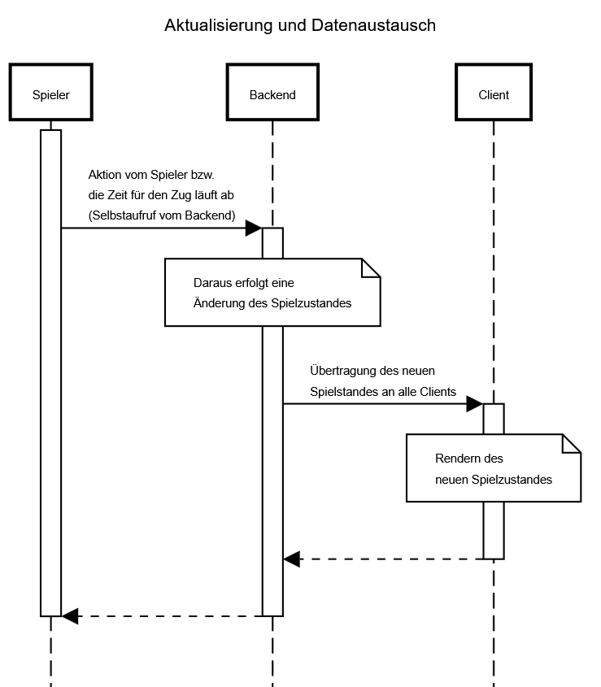

# Use-Case Anforderung: Aktualisierung und Datenaustausch

# 1. Aktualisierung und Datenaustausch

## 1.1 Kurze Beschreibung
Dieses Use-Case dient zur Anzeige von Änderungen des Spielstandes auf der Seite des Clients. Demnach ist sie rein technisch basiert und passiert automatisch während die Spieler ihre Spielzüge auspielen.
Die Aktualisierung wird durch einige von Spielern ausgelösten Ereignissen augelöst:
- Das erhalten von neuen Ressourcen nach dem Würfeln
- Platzierung von neuen Gebäuden
- Übertragung der Rolle des Spielleiters
- etc.

## 1.2 Mockup 
n/a

# 2. Ablauf von Ereignissen

## 2.1 Grundlegender Ablauf
- Der Spielzustand ändert sich
- Der Server sendet das update an allen beteiligten Spielern
- Die Clients nehmen das Update auf, evtl. ändert sich die "Match Page"

## 2.2 Alternative Abläufe
n/a

# 3. Besondere Anforderungen
n/a

# 4. Vorbedingungen
Ein Spieler muss in einem laufenden Spiel, also auf der "Match Page" sein.

# 5. Nachbedingungen
Der Client muss (immer) den aktuellen Spielzustand für den Spieler anzeigen.

# 6. Story Points
