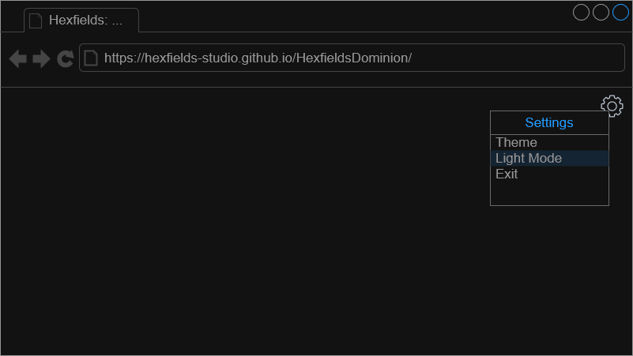
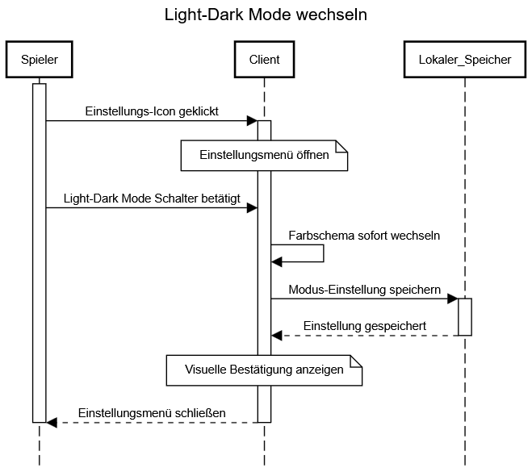
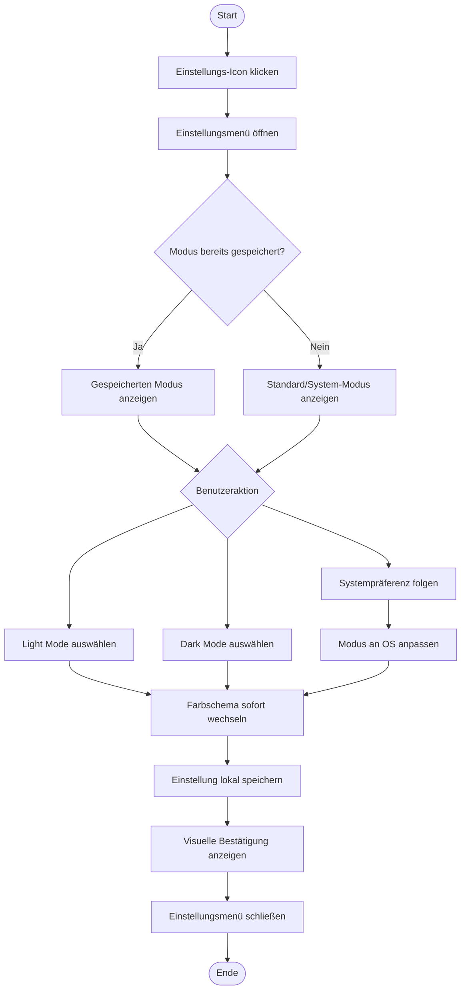

# Use-Case Spezifikation: Light-Dark Mode

## 1. Light-Dark Mode

### 1.1 Beschreibung

Dieses Use-Case ermöglicht es dem User, zwischen Hell- und Dunkelmodus der Applikation zu wechseln.

### 1.2 Mockup

### 1.3 Screenshot

n/a

## 2. Ablauf von Ereignissen

### 2.1 Grundlegender Ablauf

- Der User befindet sich auf der Home-, Start- oder Spielseite.
- Der User klickt auf das Einstellungs-Icon in der oberen rechten Ecke.
- Das Einstellungsmenü wird geöffnet.
- Der User klickt auf "Light Mode" bzw. "Dark Mode".
- Das Farbschema der Applikation wechselt sofort.
- Die Einstellung wird gespeichert.
- Das Einstellungsmenü schließt sich automatisch nach kurzer Zeit oder nach Klick außerhalb.

#### Sequenz-Diagramm

#### Aktivitäts-Diagramm (Mermaid)

### 2.2 Alternative Abläufe

- **System-Preference folgen**: Automatische Anpassung an Systemeinstellung des Betriebssystems

## 3. Besondere Anforderungen

- Der Modus muss auf allen Bildschirmen (Home, Start, Spiel) konsistent angewendet werden
- Die Einstellung muss persistent gespeichert werden
- Sofortige visuelle Rückmeldung bei Moduswechsel
- Barrierefreiheit: Ausreichender Kontrast in beiden Modi

## 4. Vorbedingungen

- Die Applikation ist geöffnet
- Der User befindet sich auf Home-, Start- oder Spielseite

## 5. Nachbedingungen

- Das Farbschema wurde geändert
- Die Einstellung wurde gespeichert
- Die Applikation behält den gewählten Modus bei zukünftigen Starts

## 6. Story Points

n/a
