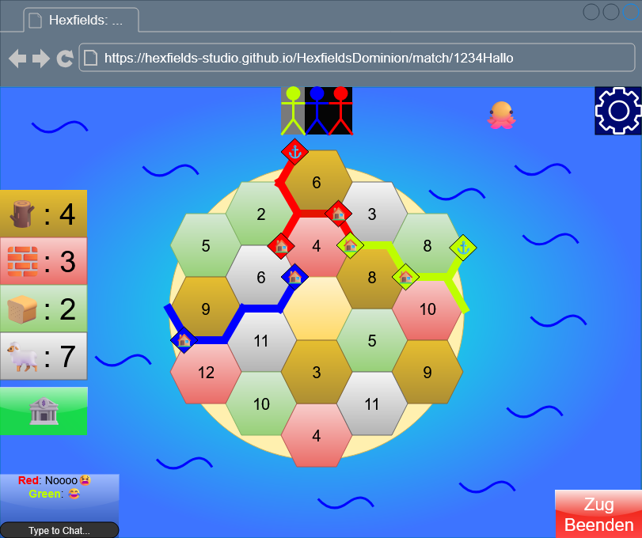

# Use-Case Anforderung: Spielfeld

# 1. Spielfeld

## 1.1 Kurze Beschreibung
Das Spielfeld Use-Case stellt das gesamte "Spielbrett" für jeden Spieler dar. Es besteht aus mehreren aneinander gereihten Feldern.
Ein Feld besteht aus einer Zahl und Ressource, die beide beim start des Spiels definiert werden. Es ist hexagon-förmig und ihre Textur gleicht der jeweiligen Ressource.
Nachdem eine Zahl gewürfelt wurde, übergibt jedes Feld, das diese Zahl trägt, seine Ressourcen an jeden Spieler unter der Bedingung, dass der Spieler die richtigen Gebäude an den Ecken des Feldes gebaut hat. 

## 1.2 Mockup 

# 2. Ablauf von Ereignissen

## 2.1 Grundlegender Ablauf
1. Ein Spieler tritt einer Lobby bei
2. Die Lobby startet das Match
3. Solange das Match läuft, muss jeder Client das Spielfeld anzeigen

## 2.2 Alternative Abläufe
n/a

# 3. Besondere Anforderungen
n/a

# 4. Vorbedingungen
Ein Spieler muss in einem laufenden Spiel, also auf der "Match Page" sein.

# 5. Nachbedingungen
Der Client muss (immer) den aktuellen Spielzustand für den Spieler anzeigen.

# 6. Story Points

