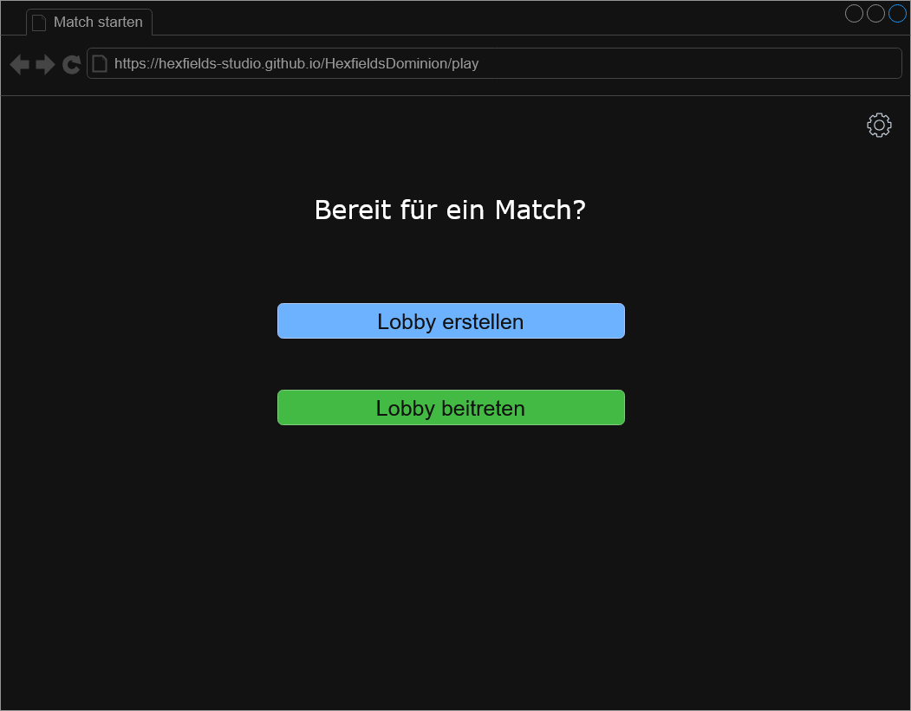
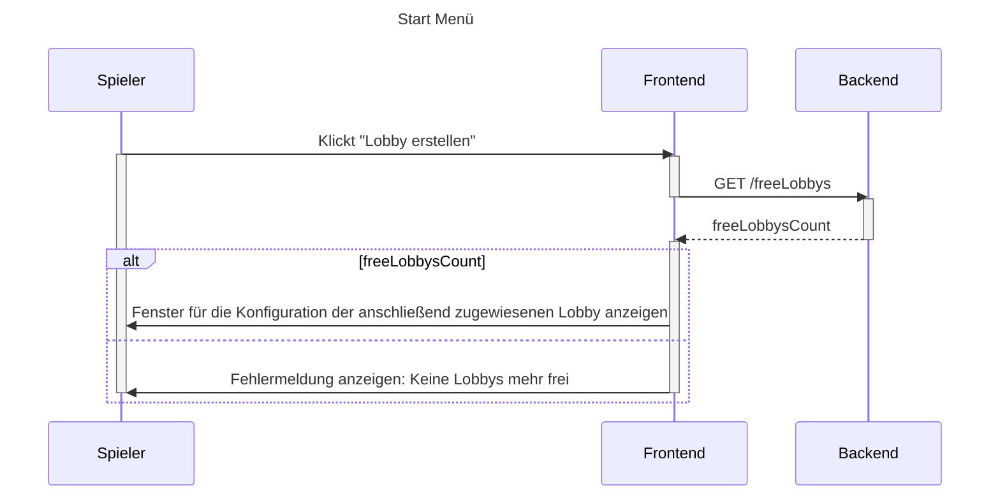
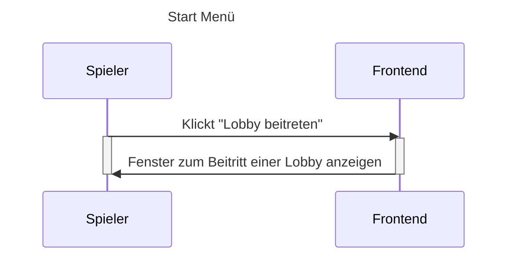

# Use-Case Anforderung: Start Menü

## 1. Start Menü

### 1.1 Kurze Beschreibung

Dieses Use-Case dient dazu, dass User einer Lobby und damit einem Match beitreten können. Dabei können sie entweder selbst eine Lobby erstellen oder einer bestehenden Lobby beitreten.

### 1.2 Mockup

## 2. Ablauf von Ereignissen

### 2.1 Ereignisse

- Die User klicken auf "Lobby erstellen"
- Das Frontend leitet zu einer freien Lobby weiter

#### Sequenzdiagramm

### 2.2 Alternative Abläufe

- Die User klicken "Lobby beitreten"
- Das Frontend öffnet das Fenster zum Beitritt einer Lobby

#### Sequenzdiagramm

### Vorbedingungen
1. Die User haben die Anwendung geöffnet.
2. Die User haben sich mit Account oder als Gast angemeldet.

### Nachbedingungen
Den Usern wird die Seite einer freien Lobby mit Konfigurationsmöglichkeiten angezeigt

## 3. Spezielle Anforderungen

n/a

## 4. Vorbedingungen
1. Die User haben die Anwendung geöffnet.
2. Die User haben sich mit Account oder als Gast angemeldet.

## 5. Nachbedingungen
Usern wird ein Fenster angezeigt, bei welchem ein Lobbycode eingegeben werden kann, um einer bestehenden Lobby beizutreten

## 6. Aufwandsschätzung

Story Points: 3
